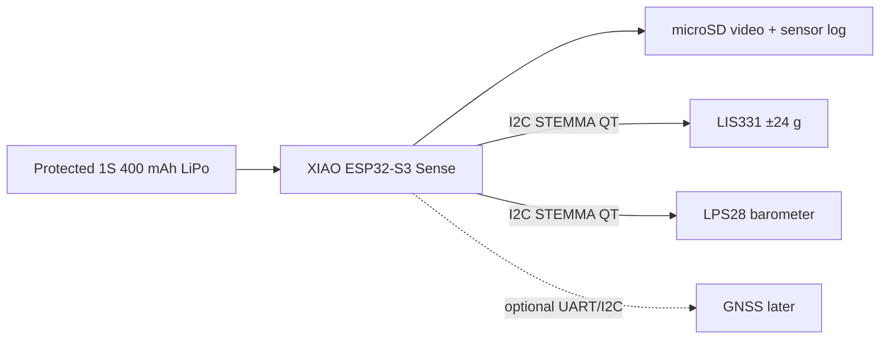
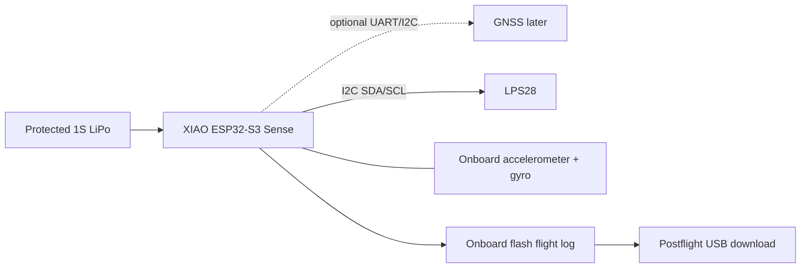

# XIAO camera flight-logger specification and packaging model

> **2026-09-19 packaging update:** The battery and LPS28 keepouts no longer overlap in the provisional layout,
> and pairwise component collision checks now run with the shell check. The updated payload CG and the current
> D12-5/E12-6 simulation results are in the [geometry sweep](DE_GEOMETRY_SWEEP.md). Earlier motor/fin results
> farther down this page are historical; the delivered boards, camera view, wiring, and battery retention still
> require a physical fit check.

> **2026-09-19 baseline update:** use the owned Seeed XIAO ESP32-S3 Sense camera and
> microSD for video/sensor logging. The baseline sensors are the Adafruit LIS331HH
> ±24 g accelerometer and LPS28 barometer. GPS is optional and is intentionally
> excluded from the current mass, power, and fit budget. Use an Adafruit 3898
> protected 400 mAh LiPo; solder a mating JST-PH pigtail to the XIAO BAT+/BAT− pads.
> The earlier nRF52840/L76K/150 mAh configuration remains historical evidence only.

> **Current hardware specification.** See [current designs](CURRENT_DESIGN.md) for the corrected geometry search,
> performance/stability tradeoffs, uncertainty results and matching V5 print project. The flights linked here include
> the recovery-wadding CG correction and the performance option's 45 mm fins.

This is a concrete **provisional hardware specification**, not measured hardware, a crash rating, or flight clearance.
The stability screen now uses 55 mm-span fins for the 24 mm C11/D12/E12 motor envelope; the prior 45 mm option is retained as a comparison, not the selected geometry.
The selected baseline is the owned **Seeed XIAO ESP32-S3 Sense**, using its camera and microSD for synchronized video
and sensor logging. GPS is deliberately optional and excluded from the baseline mass/power model. Firmware is specified
below but has not been implemented or bench-tested.

## Parts and mass budget

| Part                                                      | Nominal mass g | Upper allowance g | Geometry evidence                                                                |
| --------------------------------------------------------- | -------------: | ----------------: | -------------------------------------------------------------------------------- |
| XIAO ESP32-S3 Sense camera + microSD                     |           6.00 |              6.50 | User-weighed raw board, camera, and WiFi antenna: 6 g; installed wiring remains estimated                      |
| Adafruit LIS331HH ±24 g accelerometer                    |           2.00 |              3.00 | STEMMA QT board envelope; ±24 g setting required for boost                       |
| Optional GPS module/antenna                               |           0.00 |              0.00 | Deferred; excluded from current fit and power model                              |
| Adafruit 3898 protected 400 mAh LiPo                      |           8.20 |             10.50 | Approx. 37 × 17.5 × 8.2 mm; verify delivered mass and thickness                  |
| Adafruit LPS28 breakout 6067                              |           1.80 |              2.30 | Published 25.4 × 17.8 × 4.8 mm, 1.8 g; ported board                         |
| JST-PH 2-pin solder pigtail, Adafruit 261                 |           0.50 |              0.80 | Soldered to XIAO BAT+/BAT− pads; verify mating gender and polarity                |
| Sensor wires, camera/SD loop and strain relief            |           1.50 |              2.50 | No GNSS coax in baseline; optional GPS reserve retained                          |
| Insulating pads, ties, strain relief and seal consumables |           1.50 |              2.50 | Estimated; printed sled is accounted separately                                  |
| **Total removable payload**                               |      **21.50** |         **28.10** | XIAO raw mass measured; other masses and installed allowance provisional             |

Nominal payload CG is 92.95 mm aft of the 50 mm nose tip; upper-mass CG is 93.21 mm. These are packaging estimates after
moving the battery clear of the LPS28 board; the delivered hardware and assembled CG must be measured. The two budgets change individual
component masses rather than scaling a single lump. Dummy/actual remain equivalent mass/CG cases until hardware is
measured. CAD plastics and the existing recovery hardware ledger are added separately, not counted as PCB material.

Sources checked 2026-09-19:

- [XIAO board, IMU, flash and charging documentation](https://wiki.seeedstudio.com/XIAO_BLE/).
- GPS is intentionally deferred; add its mass, antenna keepout and power only after the camera/altimeter logger works.
- [LPS28 product 6067](https://www.adafruit.com/product/6067), listed $12.50 and in stock; its ported package is useful
  for a controlled static-pressure tube.
- [Battery 3898](https://www.adafruit.com/product/3898), protected 400 mAh 1S LiPo; verify connector polarity,
  protection, dimensions and charging limits against the delivered item.

No purchase has been made. The L76K was listed at $11.99; XIAO cost depends on whether the user already owns the Sense.
These are component prices, not a complete installed-cost estimate.

## Electrical and logging specification

The current wiring is intentionally camera-first:



The LIS331 is the authoritative powered-flight accelerometer; configure its ±24 g
range and record the launch-pad noise/gravity initialization block. The LPS28
provides the primary altitude trace through its ported static-pressure interface.
GPS is an optional later addition and is not
needed for the first camera/altimeter flight.



Use the XIAO's 3.3 V rail and common ground for the LPS28 breakout VIN. Do not feed raw LiPo voltage to sensor
logic pins. UART is crossed: XIAO D6/TX to GNSS RX, GNSS TX to D7/RX. Reserve the GNSS control pins D0/D2 pending the
delivered board's schematic review; do not use the obsolete L76-L D2/D3 UART example.
[L76K wiring/example](https://wiki.seeedstudio.com/get_start_l76k_gnss/).

LPS28 default I2C address is 0x5C; leave its SA0 jumper open unless another device collides. Use short soldered wires
for the flight layout, not bulky Grove adapters. Keep the metal pressure port accessible and avoid side load on it.
[LPS28 pinout](https://learn.adafruit.com/adafruit-lps28-pressure-sensor/pinouts).

Use a removable polarized battery connector; unplug to isolate power, with access after withdrawing the bay. Charge
outside the closed rocket, attended, using a verified 1S charger/current setting. The XIAO documentation describes
approximately 50/100 mA charging selections, but includes inconsistent prose/example details: verify the exact board
schematic and actual current before using onboard charging. Do not use the Grove Base's 500 mA setting for this cell. Do
not solder directly to a bare pouch, clamp its edges, or continue using a crushed/damaged cell.

Provisional system budget: 80 mA average and 120 mA peak at the battery, **engineering allowances to be measured**. With
only 70% of 150 mAh usable, estimated runtime is about 79 minutes at 80 mA; use a 30-minute powered-pad objective until
tested. Verify rail dropout, startup/inrush and battery discharge rating. This budget is not measured endurance.

Proposed firmware settings: IMU at 200 samples/s with ±16 g and ±2000 degrees/s ranges, pressure at 50 samples/s, GPS
initially 1 Hz. Flag saturation, missing fixes, timestamps, battery voltage and resets rather than silently
interpolating bad data. At roughly 4 kB/s, 1.5 MiB reserved logging space holds about 6.5 minutes: use a short prelaunch
ring buffer, not unlimited high-rate logging while waiting on the pad. Verify actual flash availability, sensor ODR
settings and power-loss-tolerant records before implementation. GPS does not provide remote recovery telemetry by
itself.

## Mechanical arrangement

The proposed bay is 145 mm long in a 410 mm BT-60 body, with a 50 mm cone, 55 mm-span fins and 18-inch chute. This is a
new variant, not an overwrite of the earlier fit-check project. The longer bay is primarily a static-port placement
choice, not a claim that the circuit boards alone need that length. It reduces performance and adds long-sleeve
extraction/friction risks that must be evaluated.

Axial datums aft of the shoulder: antenna 12 mm; XIAO/GPS PCB centers 39 mm; battery/barometer 73 mm; connector 99 mm.
The XIAO envelope center is 38.25 mm to allow for its USB overhang. A 34 × 26 mm overall cross-section is **not a filled
rectangular block**: individual component corner clearances are checked against the circular bore. The 28 mm-wide sled
remains clear of that bore at its actual offset.

The antenna sits forward on an independent shelf with tie slots and an insulating support pad. The XIAO and GNSS are
spaced rather than pressed face-to-face; short soldered headers need component/USB clearance and strain relief. Boards
and battery require separate ties and fitted insulating pads to the sled. The modeled pads/cables are allowances, not
proof of a completed restrained stack. Keep the barometer opening uncovered and away from adhesive/foam contact. The IMU
needs a defined rigid mounting orientation; avoid a loosely floating foam-mounted board.

The new sled has board locating rails, a separate battery pocket with end stops, and four strap stations at 31/47 and
63/83 mm aft of the shoulder. Four insulating spacer sleeves around corner header pins support the PCB-to-PCB gap; their
geometry is an approximation to be checked against actual component locations. Do not bear against the RF shield,
pressure sensor opening, or pouch edges. Retention must be tested; these features are not a crash certification.

Both installed keepouts and conservative straight insertion sweeps pass. The tightest component corner is the antenna:
**0.465 mm radial clearance** at the full supported 26 mm square envelope. That is nominal, not a tolerance guarantee.
The revised mounting bosses are clipped to the sleeve outside diameter and leave the insertion throat clear. The final
review package also checks the whole printed sled sweep and verifies no sleeve/boss intersection with the paper tube.

No carbon-filled plastic is specified around either antenna. Antenna gain, GPS reception through the assembled bay,
connector retention, EMI, and exact supplied patch dimensions remain test items. An antenna exceeding the declared
keepout is a **fit failure**, not permission to force it into the enclosure.

## Static ports and sealing

The CAD has **three 1.0 mm radial holes, 120° apart, 125 mm aft of the shoulder** (175 mm from nose tip). The purchased
paper tube also needs matching deburred holes; the assembly model shows both layers opened. Align and mark the sleeve
before drilling; do not assume an arbitrary rotation leaves the ports connected. Do not drill into installed
electronics. At 41.6 mm body OD, the shoulder distance is 3.00 diameters, following the general separation guidance in
the [PerfectFlite FireFly manual](https://www.perfectflite.com/Downloads/FireFly%20manual.pdf).

The lugs lie at 60°, between the port directions. This avoids drilling through a lug, but does not prove freedom from
lug/shoulder aerodynamic pressure bias; finite angle of attack and wind remain concerns. The location is an initial
engineering design, not a validated static-pressure station.

Two circumferential seal grooves are 6 and 132 mm aft of the shoulder, 1.3 mm wide and 0.5 mm deep. Their seals must
close the sleeve-to-paper annulus: the aft seal prevents ejection gas bypassing the bulkhead through that gap. A 0.9 mm
elastomer cross-section would have about 22% nominal radial squeeze with the assumed 0.2 mm tube clearance; this is a
sizing proposal, **not a selected, tested O-ring part**. The CAD shows compressed seal envelopes only. Measure the real
paper ID/roundness and select seals that do not tear the tube or prevent recovery separation.

The bulkhead perimeter and its three attachment screws/central eye bolt also need seals. Sled screw holes now have
closed aft ends. Printed walls themselves are not assumed airtight. Bench-check leakage, friction and recovery
separation with the actual hardware; do not treat a solid CAD boundary as a pressure or ejection qualification.

The pressure-flow sizing screen uses a conservative empty chamber volume of about 181 cm³, including the nose cavity.
For a 50 m/s altitude-change rate at sea-level ISA, smooth clear ports and assumed discharge coefficient 0.6, the sum of
viscous passage and orifice losses is about 0.81 Pa (0.068 m equivalent altitude lag). This is a simple isothermal flow
estimate, **not** a dynamic chamber validation or correction for local surface-pressure bias. Blocked ports, rough
printed holes, ejection leakage and sensor filtering can dominate. Pressure-chamber tests must measure lag and leakage;
controlled airflow/flight comparison must assess port bias.

## Vendor model availability

Use vendor geometry where it materially improves the fit model:

- Seeed publishes an official XIAO ESP32-S3 Sense STEP archive and separate top/bottom housing STEP files.
- Adafruit publishes the exact [LPS28 6067 STEP](https://github.com/adafruit/Adafruit_CAD_Parts/tree/main/6067%20LPS28%20Pressure%20Sensor), now stored under `docs/assets/avionics/vendor/`.
- The LIS331 breakout has official Eagle board files; use those to generate the board outline, then retain simple
  component-height envelopes for the connectors and sensor package.
- The 400 mAh pouch and JST cable should remain measured flexible envelopes rather than pretending a rigid STEP model
  captures bend radius, swelling, or strain relief.

The XIAO STEP is the highest-value import because the camera/SD stack and lens position affect the sled and nose view.
The Adafruit boards are flat enough that vendor board outlines plus measured populated height are faster and safer than
building a detailed component-by-component assembly.

- Seeed supplies a
  [XIAO STEP archive](https://files.seeedstudio.com/wiki/XIAO-BLE/seeed-studio-xiao-nrf52840-3d-model.zip) linked from
  its Sense documentation. It is a visual/mechanical reference, not proof of the exact delivered revision.
- Adafruit's 3D-model link points to the **BMP585**, not BMP581. We did not silently substitute that model. The BMP581
  keepout uses its own PCB outline, with explicitly estimated populated height.
- No complete official L76K/antenna STEP assembly was verified. Its board dimensions are published; antenna geometry
  remains an assumption until measured.

`scripts/avionics_vendor_models.py` downloads checksum-pinned references and exports a local STEP with the vendor XIAO
and clearly named keepouts for the other items. Its vendor-source files remain outside the published docs pending
license/revision review. Do not derive PCB masses by applying PLA density to vendor solids.

## Verification and reproduction

### Current results and files

The nominal 20.65 g payload on C5-3 reaches **57.62–59.50 m**, with guide exit **12.51–12.52 m/s** and estimated powered
load **11.66–11.67 g**. All six nominal C5 load/wind cases meet the numeric criteria. At 29.2 g, the two loaded 2 m/s
wind cases exceed the 10 m/s deployment-speed limit; four of six C5 cases meet the gates. Neither scenario is
flight-cleared.

This is the nominal altitude/speed leader in a bounded 54-geometry search, not a robust or global optimum. The long bay
costs altitude versus the generic payload. The [current comparison](CURRENT_DESIGN.md) retains the larger-fin baseline
and higher-stability alternative, with broader stress failures. Do not relax failed gates to conceal the result.

- [Full nominal/upper-mass comparison](../runs/avionics-selected-20260913/report.md)
- [Labeled two-view layout](../runs/avionics-selected-20260913/avionics-nominal/cad/avionics-layout.svg)
- [Installed detailed approximation](../runs/avionics-selected-20260913/avionics-nominal/cad/avionics-installed.step)
- [Electronics detailed approximation](../runs/avionics-selected-20260913/avionics-nominal/cad/avionics-detailed.step)
- [Component clearance report](../runs/avionics-selected-20260913/avionics-nominal/cad/avionics-fit.json)
- [Complete rocket STEP with electronics keepouts](../runs/avionics-selected-20260913/avionics-nominal/cad/assembly.step)
- [Electronics-only keepout STEP](../runs/avionics-selected-20260913/avionics-nominal/cad/avionics-keepouts.step)
- [Vented nose/bay STEP](../runs/avionics-selected-20260913/avionics-nominal/cad/nose-bay.step)
- [Vented nose/bay STL](../runs/avionics-selected-20260913/avionics-nominal/cad/nose-bay.stl)
- [Antenna-shelf sled STL](../runs/avionics-selected-20260913/avionics-nominal/cad/payload-sled.stl)
- [Revised bulkhead STL](../runs/avionics-selected-20260913/avionics-nominal/cad/bay-bulkhead.stl)
- [Archived 1.6 mm performance fin collar STL](../runs/avionics-selected-20260913/avionics-nominal/cad/fin-collar.stl)
- [Current organic fin-collar v2](FIN_COLLAR_V2.md)
- [Forward lug saddle STL](../runs/avionics-selected-20260913/avionics-nominal/cad/lug-sleeve-1.stl)
- [Aft lug saddle STL](../runs/avionics-selected-20260913/avionics-nominal/cad/lug-sleeve-2.stl)
- [Component and pressure-port data](../runs/avionics-selected-20260913/avionics-nominal/cad/avionics.json)
- [Loaded C5-3 wind-2 flight model](../runs/avionics-selected-20260913/avionics-nominal/actual-C5-3-wind2.ork)

The current local review package is `deliverables/avionics-bay-review-v4/README.md`; its regenerated CAD mass properties
are checked against the simulation before packaging. Vendor reference is in
`deliverables/avionics-vendor-reference-v2/avionics-vendor-reference.step`. The new X1C/0.4 mm/Textured PEI PLA project
is `deliverables/avionics-performance-fit-check-v5/avionics-performance-v5.3mf`, containing all six printed parts for
the performance option. It passed a local native slice check. No toolpath was sent to a printer. V3 remains the old
short-bay design; V4 contains only the three earlier avionics fit-check parts, not the new smaller fins. Electronics
keepouts and vendor boards are never intended for printing.

### Hardware checks for the user, after review

1. Confirm the owned XIAO is the original nRF52840 **Sense**, or supply a photo/name so its variant can be substituted.
2. Measure/weigh the delivered GPS antenna and populated stack. Antenna must fit the supported 26 × 26 × 8 mm envelope.
3. Check battery polarity, delivered dimensions/current rating, assembled power draw and charger setting.
4. Measure tube ID/roundness, print fit and mass; select/test seal material and separation friction before flight.
5. Bench-check strap retention, electrical continuity, pressure leakage/lag and logging. No part here is
   crash-qualified.

```sh
uv run --extra cad python scripts/study_avionics.py --base-config examples/avionics-performance.yaml
uv run python scripts/avionics_vendor_models.py
uv run pytest --run-integration -q
```

The avionics study retains both nominal and upper-mass configurations, all five motor/delay choices, three loadings, two
winds, CAD exports, flight models and reports. Geometry tests check valid single-solid printed parts, component and
routing keepout collisions, actual radial fit, open sleeve ports and mass/CG arithmetic. Physical fit, seals, power
integrity, flight logging, pressure accuracy and impact survival remain unvalidated.
