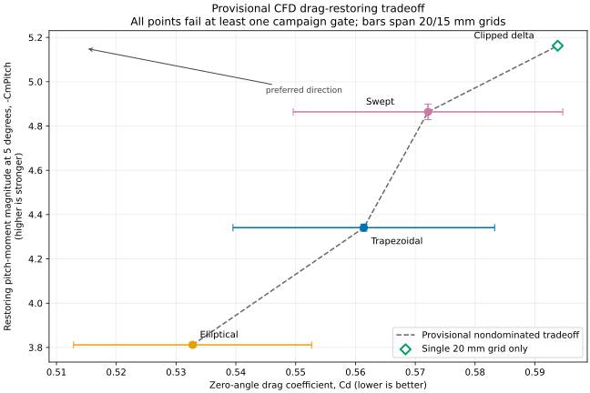

# Exploratory CFD fin ranking

**Decision:** no fin is a formally validated winner or loser. The campaign does, however, show a repeatable provisional
tradeoff among the planar fins. The elliptical fin has the lowest computed drag and the weakest restoring response; the
swept and clipped-delta fins buy stronger restoring response with more drag; the trapezoid lies between them. The 5 mm
and 10 mm ring tails are unrankable because their volume meshes fail the unchanged quality gate.

## Claim boundary

The NACA 0012 validation ladder failed its strict first gate: the documented Spalart–Allmaras control produced
`Cd = 0.0084913754`, versus the NASA CFL3D value `0.0081924676`, a difference of about 3.65% and outside the declared
absolute tolerance of 0.0002. Later matched-model diagnostics were much closer, but they do not erase the failed entry
gate. Consequently, the rocket results below are exploratory relative evidence, not validated flight coefficients.

The fin campaign also failed its own strict acceptance gates:

- Every solved zero-angle rocket case failed the declared lateral force/moment symmetry screen.
- Several fine-grid 5-degree cases failed the strict last-100 settling screen in lateral, yaw, or roll modes.
- The ring meshes failed `checkMesh` before any solver run.

The machine-readable consolidated audit therefore reports zero formally rankable zero-angle designs and no formal drag
winner.

## Matched planar results

All planar fins have the same nominal area, body, flow conditions, force axes, and solver image. Values are last-100
iteration means. Lower `Cd` is better; a more negative `CmPitch` at 5 degrees is the stronger restoring response under
the campaign's axis convention.

| Design        | `Cd`, 0 degrees, 20 / 15 mm | `Cd`, 5 degrees, 20 / 15 mm | `Cl`, 5 degrees, 20 / 15 mm | `CmPitch`, 5 degrees, 20 / 15 mm |
| ------------- | --------------------------: | --------------------------: | --------------------------: | -------------------------------: |
| Elliptical    |           0.55268 / 0.51286 |           0.67491 / 0.64425 |           1.17761 / 1.17667 |              -3.82163 / -3.80205 |
| Trapezoidal   |           0.58328 / 0.53952 |           0.71473 / 0.67981 |           1.26915 / 1.26640 |              -4.35692 / -4.32510 |
| Swept         |           0.59467 / 0.54959 |           0.73001 / 0.69529 |           1.34181 / 1.35928 |              -4.82853 / -4.89918 |
| Clipped delta |       0.59382 / unavailable |       0.73162 / unavailable |       1.39522 / unavailable |           -5.16247 / unavailable |

## Provisional Pareto frontier



The plot minimizes zero-angle `Cd` while maximizing the magnitude of the restoring `CmPitch` at 5 degrees. Solid markers
are the midpoint of the 20 and 15 mm-grid results, with bars spanning those two values; the hollow clipped-delta marker
is its available 20 mm-grid result only. Every point is provisional because it failed at least one campaign gate.
“Frontier” here means nondominated among these exploratory points, not validated superiority or a global optimum.

The ordering is stable wherever both grids exist:

- Drag: elliptical, then trapezoidal, then swept.
- Restoring response at 5 degrees: swept, then trapezoidal, then elliptical.
- The coarse-grid clipped delta is close to the swept fin in drag and has the strongest computed lift and restoring
  pitch moment, but its fine mesh failed before solving.

The declared zero-angle drag intervals overlap:

- Elliptical: 0.51286 to 0.55268
- Trapezoidal: 0.53952 to 0.58328
- Swept: 0.54959 to 0.59467

Thus even the provisional data do not satisfy the predeclared rule that a clear winner's entire two-grid interval must
lie below a competitor's interval. The paired grid-by-grid gaps are nevertheless directionally consistent: relative to
the ellipse, the trapezoid has about 5.2–5.5% more zero-angle drag and the swept fin about 7.2–7.6% more.

## Ring-tail outcome

Both ring surfaces pass CAD validity, closure, winding, positive-volume, symmetry, and reference checks. Their original
level-4 meshes failed the skewness gate. A predeclared remediation reran a matched plain clipped-delta control and both
rings with surface refinement raised from level 4 to level 5; no mesh-quality thresholds were relaxed.

| Level-5 case        |     Cells | Maximum skewness | Result                       |
| ------------------- | --------: | ---------------: | ---------------------------- |
| Plain clipped delta | 1,146,206 |           3.4687 | `Mesh OK`                    |
| 5 mm ring           | 1,270,383 |           4.1466 | Failed: 68 highly skew faces |
| 10 mm ring          | 1,321,305 |           4.1425 | Failed: 68 highly skew faces |

Because the matched control passes and both rings fail, the remaining issue is localized to the ring geometry/junction
at this meshing strategy. This says nothing by itself about printability: a 1.2 mm wall can be printable while still
creating poor CFD volume cells. Neither ring is an aerodynamic loser; both are simply unrankable with the current mesh
construction.

## Design decision

There is no universal CFD winner. The useful provisional Pareto ranking is:

1. Choose the ellipse when minimizing drag is the priority and independent stability analysis confirms adequate margin.
2. Choose the clipped delta or swept fin when stronger restoring response is worth the drag penalty; the clipped delta
   currently has the strongest coarse-grid response but incomplete grid evidence.
3. Choose the trapezoid as the middle compromise.
4. Do not select or reject either ring from this CFD campaign.

Before using CFD for a flight-design decision, the next high-value work is to fix the zero-angle symmetry/orientation
sensitivity and obtain a second acceptable clipped-delta grid. Further ring solving should wait for a different
junction/meshing treatment rather than another blind refinement increase.

## Evidence

- Validation boundary: [`../cfd/NACA0012_VALIDATION_LADDER_REPORT.md`](../cfd/NACA0012_VALIDATION_LADDER_REPORT.md)
- Predeclared campaign: [`../cfd/fin-ranking-plan-v1.json`](../cfd/fin-ranking-plan-v1.json)
- Predeclared ring remediation:
  [`../cfd/fin-ranking-ring-mesh-remediation-v1.json`](../cfd/fin-ranking-ring-mesh-remediation-v1.json)
- Raw campaign and consolidated audit: `runs/cfd-fin-ranking-v1-20260915/`
- Ring remediation evidence: `runs/cfd-fin-ring-remediation-v1-20260916/`

Regenerate the Pareto plot from the retained audit without rerunning CFD:

```bash
uv run python scripts/plot_cfd_fin_pareto.py \
  --audit runs/cfd-fin-ranking-v1-20260915/final-ranking-audit-20260916/ranking.json \
  --output plots/cfd-fin-pareto.svg
```

Raw run directories are intentionally ignored by Git; the plans, generators, audit code, tests, and this interpretation
are the reproducible committed record.
