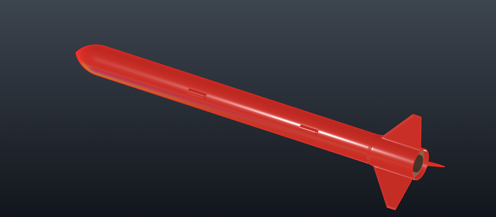
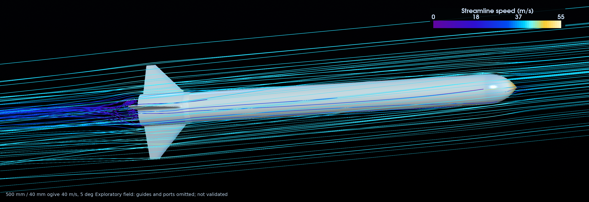

# Current-design flow visualization and port study

The 500 mm body / 40 mm ogive candidate can be rendered with its actual integrated fin-collar STEP. A new flow
visualization uses a **sealed exterior approximation** of that geometry, not the old swept-fin case. It is exploratory
CFD, not an accepted drag correction or evidence of flight safety.

## CAD review



The studio view shows the existing guide sleeves, not the planned 3/16-inch revision. Camera and pressure openings are
not yet modeled. See the [fin-detail view](assets/500-ogive-review/500-ogive-fin-detail.png) and
[render provenance](assets/500-ogive-review/render-manifest.json).

## Computed flow



The retained calculation has **1,095,261 cells** and fields at iteration 1,000. Surface closure and mesh checks passed,
and the final 100 coefficient records pass the existing settling screen. Terminal logging ended before completion was
fully recorded, so the retained parallel fields were reconstructed in a separate copy; the original solver-completion
flag remains false. The serialized surface also fails a strict stored-normal check on 60 very small triangles. These
limitations, plus unresolved mesh/wall sensitivity, prevent quantitative design acceptance. The
[compact audit](assets/500-ogive-review/cfd-audit.json) retains the checks, residuals, wall-resolution statistics and
recovery provenance.

## What the flow picture can tell us

Streamlines traced from a solved velocity field show the computed local direction and speed of the air for one steady
condition. They are not smoke trajectories from a physical test, and a smooth picture does not establish an accurate
solution. The retained external-body benchmark did not pass its acceptance gates; see the
[CFD handoff](../CFD_HANDOFF.md). No coefficient from this case is used by the flight robustness study.

The visualization setup is 40 m/s at 5 degrees angle of attack, incompressible steady SST, with a 15 mm background mesh
and level-four surface refinement (nominally 0.94 mm before snapping). It has no inflation layers and is not a
mesh-independence study. Launch guides, nozzle/plume, surface roughness, camera opening and pressure ports are omitted.
The under-collar assembly clearance is sealed for external flow; the printable model remains unchanged.

## Why a port delta needs a different study

The proposed camera clearance is approximately 5 mm, but its wall thickness, recess depth, lens face, chamfer, location
and connection to internal air volumes are not finalized. A camera behind a sealed window, a shallow closed pocket and
an open hole into the bay are different fluid geometries. The pressure vents also connect to an internal volume, rather
than simply indenting the surface.

The existing 1 mm pressure vents would be only about one nominal surface cell across in this visualization mesh. The
camera opening would be about five. That does not resolve port-edge flow, cavity pressure or a small drag difference.
Subtracting two such runs would not isolate a trustworthy port effect.

A useful next port comparison should:

- Freeze lens/window/recess geometry and bay sealing; keep camera and barometer pressure paths distinct unless
  deliberately modeling their communication.
- Compare a sealed baseline, camera-only, pressure-vents-only and combined case, with identical external geometry and
  numerical settings elsewhere.
- Use local aperture/cavity refinement and near-wall treatment; start with at least ten cells across the smallest
  opening as a meshing trial, then demonstrate stability of the **difference** on at least three successively refined
  meshes. Ten cells is not an accuracy guarantee.
- Include axial flow and representative nonzero angles/roll orientations. Record port pressure coefficients, cavity
  pressure, forces and moments, not only drag.
- Require the claimed effect to exceed iterative and mesh/domain/scheme variation; report an unresolved effect if it
  does not. Use a transient calculation if a steady cavity solution cannot settle.

Barometer response during ascent additionally depends on cavity volume, leak paths, vent resistance and changing ambient
pressure. A steady exterior pressure picture does not validate that time response. Physical pressure-response and camera
field-of-view checks remain necessary.

## Reproduction

The case adapter is `scripts/cfd_external_case.py`. It takes a closed STEP exterior in millimetres with the nose at Z=0,
converts to OpenFOAM metres with the axis along +X, records source hashes, and retains the existing hard surface-closure
gate. It only creates a new run directory. `scripts/cfd_run.py` records image identity, resource limits, mesh checks and
solver logs; `scripts/cfd_audit.py` reports the result without making it accepted design evidence.

Heavy meshes and fields remain in ignored `runs/`; renders remain in `deliverables/`. Preserve failed attempts alongside
successful runs.

The retained current-design case is `runs/cfd-500-ogive-a5-20260919-v1`, sourced from
`runs/render-500-ogive-20260919-v3/external-no-guides-mm.step`. Its moment origin is a fixed 300 mm station from the
nose, **not** the assembled CG. The rendered fields are in `runs/cfd-500-ogive-a5-20260919-reconstructed-v1`;
`reconstruction.json` records the independent reconstruction without changing the original run's evidence.

To prepare and execute an independent repeat, choose a new output directory:

```sh
PYTHONPATH=src:scripts uv run --frozen python scripts/cfd_external_case.py \
  --config runs/render-500-ogive-20260919-v3/config.json \
  --external-step runs/render-500-ogive-20260919-v3/external-no-guides-mm.step \
  --output runs/cfd-500-ogive-a5-REPEAT
PYTHONPATH=src:scripts uv run --frozen python scripts/cfd_run.py \
  --case runs/cfd-500-ogive-a5-REPEAT \
  --image rocket-workbench-cfd:2512-native --mpi-ranks 8 --cpus 8 --memory 16g
```
