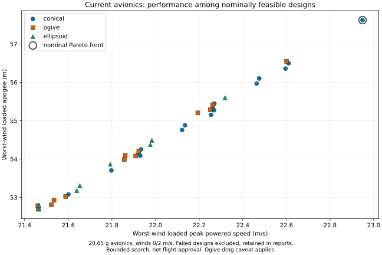
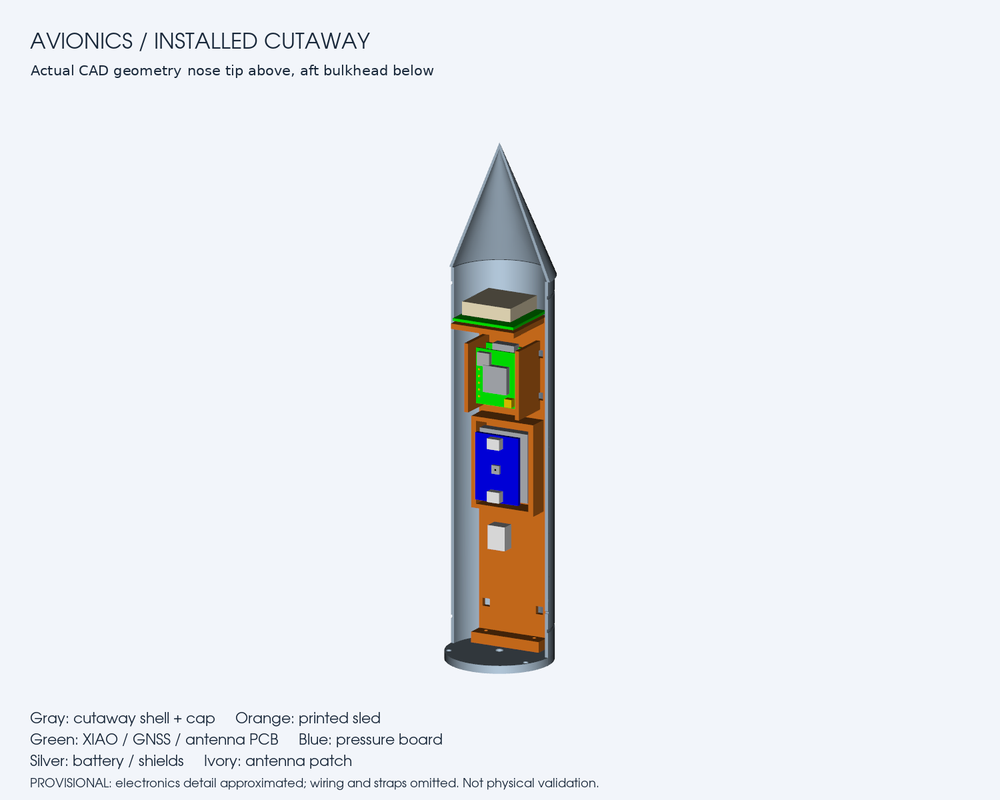

# Current avionics designs and comparison

**Current development shortlist:** D12-5 in BT-60, 50 mm conical nose and small clipped-delta fins, with either a 460 mm
body / provisional 22-inch chute or a 500 mm body / literature-characterized Apogee 24-inch chute. Both pass **192/192
planned dummy/logger cases** in the completed expanded recovery study (Cd 0.53–1.04, including an upper chute-mass
allowance). This is a bounded comparison, not physical validation or a global optimum.

| Recovery / body          | Loaded altitude m | Powered speed m/s | Descent m/s | Landing displacement m |
| ------------------------ | ----------------- | ----------------- | ----------- | ---------------------- |
| Generic 22 inch / 460 mm | 145.12–187.64     | 50.40–60.36       | 3.76–5.72   | 0.04–145.07            |
| Sourced 24 inch / 500 mm | 146.40–187.74     | 50.78–60.61       | 3.44–5.22   | 0.04–165.24            |

The 24-inch option offers more modeled descent margin and a specific sourced canopy, with more drift and a longer body.
The small speed/altitude differences do not establish a decisive aerodynamic advantage. Its nominal mass is from a
published specimen, not our delivered hardware; packing is still provisional. Final selection awaits integration.

The earlier 20-inch/430 mm leader passes only **156/192** expanded cases, with 36 descent-speed failures. Its historical
192/192 result applies only to the narrower Cd 0.6–0.9 study.

See the [fin, recovery and uncertainty comparison](FIN_SHAPES.md) for the 22-/24-inch recovery tradeoffs, failed designs
and actual study bounds. CFD has not been accepted, hardware mass/packing remain provisional, and recovery attachment
strength still requires physical checks. The printable review project below has **not** been replaced by the D12 study.

**New comparison:** [24 mm motors in BT-60](MOTOR24.md) provides substantially more predicted altitude and payload
margin. The 18 mm downloads below remain the existing review package, not a newly selected 24 mm design.

## Existing 18 mm review package

**Reading the older package's heights:** its loaded leader is about 58–60 m nominally, or 52–54 m at the upper avionics
mass allowance. The retained studies still used a 30–120 m demonstration screening gate; 120 m is neither a physical
ceiling nor your performance target. It is not what limits the leader's altitude. See
[next platform and motor choices](NEXT_PLATFORM.md) for the proposed higher-performance comparison. Historical
gates/results are preserved, not retroactively relabeled.

## What to inspect

The **45 mm-fin cone** is the nominal altitude/speed leader. The **55 mm-fin cone** remains a useful baseline with more
passing stress corners. Do not choose between them from pass counts alone: the scenarios are not probabilities. The
longer ogive is a stability comparison, not a recommendation based on small aerodynamic differences.

All three use the provisional 20.65 g avionics package (29.20 g upper allowance), a 145 mm sealed bay, BT-60 tube,
18-inch chute and commercial 18 mm motor. Printed parts are counted separately. Values below are loaded C5-3 results at
winds 0 and 2 m/s; dry mass excludes the motor. Each has six nominal C5 load/wind cases meeting the numeric gates.

| Review option          | Nose / body / fin span mm | Loaded dry mass g | Apogee m    | Powered speed m/s | Lowest loaded ascent stability cal |
| ---------------------- | ------------------------- | ----------------- | ----------- | ----------------- | ---------------------------------- |
| Performance cone       | 50 / 410 / 45             | 157.15            | 57.62–59.50 | 22.95–23.10       | 1.684                              |
| Larger-fin baseline    | 50 / 410 / 55             | 159.92            | 55.15–57.18 | 22.25–22.41       | 1.754                              |
| Higher-stability ogive | 50 / 440 / 55             | 164.39            | 53.03–55.05 | 21.59–21.73       | 2.325                              |

The performance option saves 2.77 g versus the larger-fin baseline. Its worst-wind loaded altitude improves about 4.5%
and powered speed about 3.1%, while its smaller fins lose margin in some empty, higher-wind stress cases. More nominal
stability in the longer ogive does not solve slow guide departure or late deployment at higher mass.



## Search and uncertainty evidence

The corrected search evaluates **54 geometries and 1,620 flights**: conical/ogive/ellipsoid noses, lengths 50/70/90 mm,
body lengths 410/440 mm, fin spans 45/50/55 mm, five motor/delay choices, three loadings, winds 0/2 m/s. CAD mass and CG
are regenerated for every geometry; installed/insertion fit is checked. **37 geometry/motor combinations** meet all six
nominal cases, all on C5-3. Other motors and failed geometries remain in the report.

The performance Pareto set maximizes worst-wind loaded altitude and powered speed only after nominal feasibility.
Finalist stress tests include that performance leader and the highest loaded-stability alternative, plus the existing 55
mm-fin baseline. This is not an exhaustive robust optimization of every feasible geometry.

| Option                 | Nominal avionics stress cases meeting gates | Upper avionics stress cases meeting gates |
| ---------------------- | ------------------------------------------- | ----------------------------------------- |
| Performance cone       | 32/72                                       | 24/72                                     |
| Larger-fin baseline    | 36/72                                       | 28/72                                     |
| Higher-stability ogive | 36/72                                       | 20/72                                     |

Each 72-case grid varies printed mass 1.0/1.2, payload CG -5/+5 mm, parachute Cd 0.6/0.9, winds 0/2/4 m/s, and three
loadings. The nominal/upper budgets produce **432 additional stress simulations** across the three options. Failures
include excessive deployment speed, insufficient guide departure speed, some excessive descent speeds and, for the
smaller fins, four empty-case stability failures per mass budget. No pass fraction is a reliability estimate.

The performance option additionally has **60 fresh full motor/load/wind cases** at nominal and upper avionics mass. All
simulations completed; completed does not mean feasible. Dummy and actual remain equivalent mass/CG surrogates.

- [Complete geometry/motor comparison](../runs/avionics-geometry-20260913-corrected/report.md)
- [Search bounds and objectives](../runs/avionics-geometry-20260913-corrected/search-spec.json)
- [Machine-readable comparisons](../runs/avionics-geometry-20260913-corrected/comparison.json)
- [Nominal altitude/speed Pareto set](../runs/avionics-geometry-20260913-corrected/pareto.json)
- [Performance and stability finalist stress reports](../runs/avionics-finalist-stress-20260913/report.md)
- [Larger-fin baseline stress reports](../runs/avionics-baseline-stress-20260913/report.md)
- [Performance option: full nominal/upper motor comparison](../runs/avionics-selected-20260913/report.md)
- [Performance option nominal CSV](../runs/avionics-selected-20260913/avionics-nominal/results.csv)
- [Performance option nominal time histories and checks](../runs/avionics-selected-20260913/avionics-nominal/results.json)
- [Performance option upper-mass CSV](../runs/avionics-selected-20260913/avionics-upper-mass/results.csv)
- [Performance option upper-mass time histories and checks](../runs/avionics-selected-20260913/avionics-upper-mass/results.json)

## Matching CAD, flight and print files

Resolved input files: [performance cone](../examples/avionics-performance.yaml),
[larger-fin baseline](../examples/avionics-larger-fins.yaml), and
[higher-stability ogive](../examples/avionics-stability.yaml). Keep each configuration with its matching CAD and flight
model.

**V5 is the performance option, not the larger-fin baseline.** Its native unsliced Bambu project contains all six
printed parts for X1 Carbon, 0.4 mm nozzle, Textured PEI and provisional PLA settings. It passed a local slice check;
inspect supports and every sliced layer before a fit print. No toolpath was sent to a printer.

- [V5 six-part Bambu Studio project](../docs-evidence/prints/avionics-performance-v5.3mf)
- [V5 source-mesh and project hashes](../docs-evidence/prints/avionics-performance-v5-manifest.json)
- [Fresh six-orientation-per-part screen](../runs/avionics-orientation-20260913/report.md)
- [Performance cone complete STEP](../runs/avionics-geometry-20260913-corrected/conical-n50-b410-f45/cad/assembly.step)
- [Performance cone loaded C5-3 wind-2 ORK](../runs/avionics-geometry-20260913-corrected/conical-n50-b410-f45/actual-C5-3-wind2.ork)
- [Larger-fin baseline complete STEP](../runs/avionics-geometry-20260913-corrected/conical-n50-b410-f55/cad/assembly.step)
- [Larger-fin baseline loaded C5-3 wind-2 ORK](../runs/avionics-geometry-20260913-corrected/conical-n50-b410-f55/actual-C5-3-wind2.ork)
- [Higher-stability ogive complete STEP](../runs/avionics-geometry-20260913-corrected/ogive-n50-b440-f55/cad/assembly.step)
- [Higher-stability ogive loaded C5-3 wind-2 ORK](../runs/avionics-geometry-20260913-corrected/ogive-n50-b440-f55/actual-C5-3-wind2.ork)
- [Hardware specification, individual parts and avionics STEP](AVIONICS_DESIGN.md)



[Exploded avionics render](assets/avionics/exploded.png). These are actual CAD renders with explicitly approximate
electronics details. Wiring and straps are omitted visually, not from the mass/space allowances. The paper tube is
omitted from the cutaway. Nominal antenna corner clearance remains only 0.465 mm.

## What changed, and what has not been proven

The preceding avionics configuration incorrectly placed recovery-wadding mass in the motor-mount region. The corrected
model positions a provisional 10 mm axial allowance between the packed chute and mount and rejects overlaps. Its mass is
unchanged; CG is recomputed for every geometry. The first interrupted search is retained locally as diagnostic evidence
and excluded from these rankings. Actual wadding quantity and packing must follow the product instructions and be
measured; 10 mm is a model allowance, not a preparation instruction.

The old generic-payload shortlist, nose ranking, 72/72 recovery result and acceleration numbers are historical. The old
orientation method remains useful, but its sled and V3 project are not the current avionics assembly.

This search holds bay architecture, wall/fin thickness, tube diameter and recovery hardware fixed. It does not prove
that a shorter/lighter sealed bay, lighter carrier, different compatible commercial motor/delay, or different guide
cannot improve the result. Those are next controlled design changes, not reasons to relax failed gates. A larger chute
may improve descent but adds mass/packing/drift and does not fix guide departure or deployment timing. The ogive drag
model has a documented upstream caveat in the [archived nose study](NOSE_STUDY.md).

Before flight decisions: identify and weigh hardware, fit-print, measure assembled CG, verify retention and seals, test
pressure response and recovery separation, and rerun the measured configuration. Firmware and actual sensor logging are
not implemented or qualified by these studies. No candidate is flight-cleared.

## Reproduce

```sh
uv run --extra cad python scripts/study_avionics_geometry.py --output runs/new-avionics-geometry
uv run --extra cad python scripts/stress_avionics_finalists.py \
  --study runs/new-avionics-geometry --output runs/new-avionics-stress
uv run --extra cad python scripts/stress_avionics_finalists.py \
  --study runs/new-avionics-geometry --design conical-n50-b410-f55 --output runs/new-baseline-stress
uv run --extra cad python scripts/study_avionics.py \
  --base-config runs/new-avionics-geometry/conical-n50-b410-f45/config.yaml --output runs/new-selected-masses
```

Use new output directories; historical evidence is not overwritten. The named performance option is the result of this
retained search, not a promise that future measured inputs will choose the same geometry.
