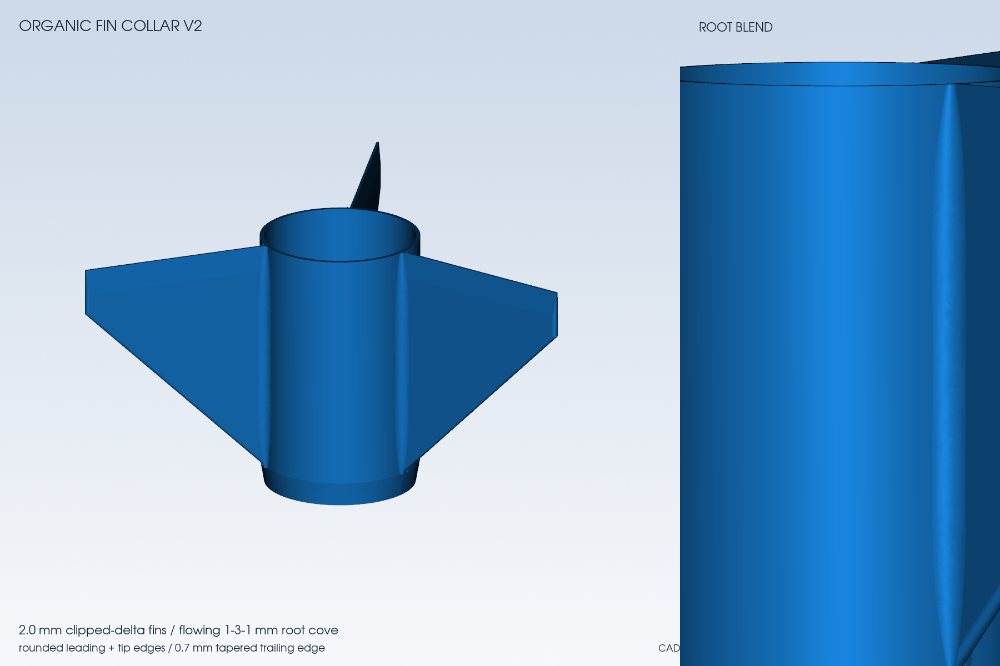

# Organic fin-collar v2

This is the current standalone fin-collar candidate for the D12-5 / BT-60 design. It supersedes the 1.6 mm square-edge
collar embedded in the older six-part X1C projects; it does not update the separate launch-lug sleeves.

## Geometry

| Feature                      |                                         Value |
| ---------------------------- | --------------------------------------------: |
| Fin planform                 |                      Three clipped-delta fins |
| Root / collar length         |                                         65 mm |
| Span                         |                                      53.65 mm |
| Nominal thickness            |                                        2.0 mm |
| Root cove                    | 0.8 mm at ends, smoothly increasing to 3.0 mm |
| Hidden cove overlap          |                    0.2 mm into collar and fin |
| Trailing edge                |                     0.7 mm after a 7 mm taper |
| Estimated solid-density mass |                                       28.92 g |

The leading and outer-tip edges are rounded. Each root cove is constructed tangent to both the actual cylindrical collar
and the planar fin side. V1 used a flat tangent-plane approximation that left a visible trough and is rejected.

## Downloads

- [Print-oriented STL](assets/fin-collar-v2/fin-collar-v2.stl)
- [Editable STEP](assets/fin-collar-v2/fin-collar-v2.step)
- [Resolved configuration](assets/fin-collar-v2/config.json)
- [Machine-readable design summary](assets/fin-collar-v2/design-summary.json)
- [SHA-256 manifest](assets/fin-collar-v2/SHA256SUMS)

The STL is exported aft-down. Geometric inspection reports one valid solid, fit within a 236 mm square, and no
downward-facing area above the first-layer screen. The exported STL volume agrees with the CAD volume within 0.02%. The
updated 36-inch-guide OpenRocket check predicts 12.91–12.92 m/s loaded guide departure, 1.66–2.46 cal minimum loaded
stability, and 174.95–181.80 m loaded apogee across 0/2/4 m/s wind cases.

## Before printing or flight use

- Inspect the imported mesh and every sliced layer in Bambu Studio; native v2 slicing was not available on the Linux
  workstation that generated this release.
- Confirm the collar fit on the delivered BT-60 tube before bonding.
- Treat the first print as a fit and strength article. Bend-test and inspect the roots and layer adhesion.
- Weigh the printed collar and rerun the assembled mass/CG cases with that measurement.
- Do not infer physical strength, aerodynamic validation, or flight clearance from the CAD and simulations.

The root cove and rounded edges are not resolved aerodynamic surfaces in the native OpenRocket model. A quick CFD
comparison was intentionally not used because the current rocket CFD workflow is not validated for design selection and
the millimetre-scale cove would require a dedicated mesh-sensitivity study.
