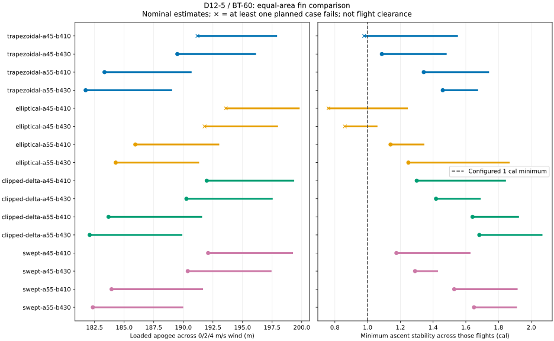
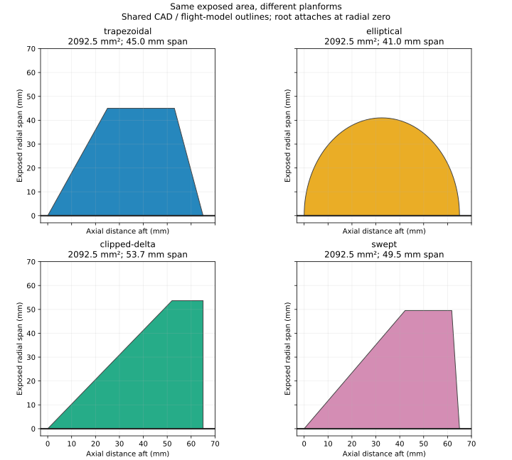
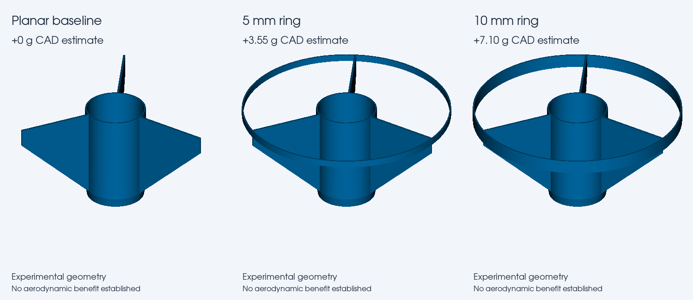

# Fin-shape, recovery and performance comparison

The first D12-5 / BT-60 screen completed **144 of 144 flights across 16 designs**. Thirteen designs meet the configured
numeric criteria in all six nominal dummy/logger cases. Subsequent uncertainty, recovery and insert-integration studies
are complete and summarized below. The [current shortlist](CURRENT_DESIGN.md) is the review starting point; the initial
144-case screen is not the final hardware configuration. CFD remains unaccepted, and no result establishes physical
flight approval or a global optimum.

## What changed

Four planforms—trapezoidal, elliptical, clipped delta and swept—were compared at two exposed areas per fin (2,092.5 and
2,557.5 mm²) and two BT-60 body lengths (410 and 430 mm). Root chord, thickness, fin count, nose, avionics, mount and
recovery assumptions stayed fixed. Matching area means the span varies between shapes. The elliptical boundary is a
64-segment polygon shared by CAD and the native freeform flight model, not an exact curved surface or an airfoil. Tests
verify that OpenRocket reads those points correctly.

All cases use D12-5 and winds of 0, 2 and 4 m/s. Dummy and actual logger are the planned loadings; physically empty is a
separate diagnostic. A matched dummy and logger have identical modeled mass properties; their agreement is not an
independent validation. Keep empty failures visible, but do not treat them as failures of the dummy-loaded progression.

## Initial findings

| Design                           | Loaded altitude range | Minimum stability | Nominal planned passes |
| -------------------------------- | --------------------- | ----------------- | ---------------------- |
| Small trapezoid, 410 mm body     | 191.2–197.8 m         | 0.979 cal         | 4/6                    |
| Small trapezoid, 430 mm body     | 189.5–196.1 m         | 1.087 cal         | 6/6                    |
| Small elliptical, 410 mm body    | 193.6–199.8 m         | 0.761 cal         | 2/6                    |
| Large elliptical, 410 mm body    | 185.9–193.0 m         | 1.140 cal         | 6/6                    |
| Small clipped delta, 410 mm body | 192.0–199.3 m         | 1.300 cal         | 6/6                    |
| Small swept, 410 mm body         | 192.1–199.2 m         | 1.176 cal         | 6/6                    |

“Small” and “large” mean the two area levels above, not equal spans. Ranges span the three wind cases, not statistical
confidence intervals. The small swept and clipped-delta variants are promising performance candidates; their tiny
altitude difference is not a defensible claim of superiority. The delta has more modeled stability margin. Increasing
fin area improves margin but costs altitude and speed. The small ellipse's highest altitude does not excuse its
stability failures. No candidate is selected solely by altitude.

## Inspect the evidence

- [All 16 designs and individual flight reports](../runs/fin-shapes-20260913/report.md)
- [Machine-readable comparison](../runs/fin-shapes-20260913/comparison.json)
- [Bounded search specification](../runs/fin-shapes-20260913/search-spec.json)

Each local design directory also contains its resolved inputs, CAD STL/STEP assembly, native flight models, individual
time histories, mass ledger, dummy mass/CG targets and hashed manifest. These outputs remain provisional, not printing
or launch approval. A separate integrated D12 X1C review project is linked from the current-design page.

## Recovery integration and printability

The [recovery-anchor integration decision](RECOVERY_ANCHOR.md) records the planned attachment path and the separate
Estes/custom-anchor options. No unmeasured anchor has silently replaced the current harness allowance.

### Print-orientation results

All 16 exported fin collars are valid single solids and fit the 236 mm usable bed envelope aft-down. The small clipped
delta has **420.4 mm²** first-layer average contact area, compared with **163.5 mm²** for the small trapezoid, **176.8
mm²** for the small ellipse and **170.2 mm²** for the small swept fin. Its flat trailing edge also eliminates measured
downward-facing area above the first layer under this geometric screening method. This favors the delta for printing,
but does not establish adhesion, interlayer strength or crash survival.
[All orientation results](../runs/fin-orientation-20260913/report.md) and
[machine-readable measurements](../runs/fin-orientation-20260913/comparison.json).

### Uncertainty and CFD status

The 1,440-case uncertainty study completed across five finalists: nominal/upper avionics, mount mass ×1/1.5, printed
mass ×1/1.2, payload CG ±5 mm, parachute Cd 0.6/0.9 and winds 0/2/4 m/s. Completed subsets show that the 18-inch
recovery assumption fails the descent-speed gate at some heavier, low-drag corners. Fin choice alone cannot resolve
those failures. A larger parachute must also be evaluated for mass, packing space and drift.

All 960 planned dummy/logger and 480 diagnostic-empty cases completed. None of the five finalists passes every planned
corner. The small trapezoid passes 104/192 planned corners; each other finalist passes 108/192. These counts are not
success probabilities: this grid deliberately includes adverse parameter combinations and duplicates mass-matched
dummy/logger cases. Descent-speed failures dominate; the small trapezoid also has heavy-mount stability failures.
[Full uncertainty report](../runs/fin-stress-20260913/report.md),
[comparison data](../runs/fin-stress-20260913/comparison.json) and
[selection and study bounds](../runs/fin-stress-20260913/search-spec.json).

The isolated OpenFOAM cavity installation check passes. The first rocket pilot is rejected: its mesh has two skew faces
above the checker threshold, and force reporting encountered a solver SHA1 stream error. The runner now checks
mesh-quality text instead of assuming a zero process exit means a good mesh. No rocket CFD result is accepted, and no
CFD coefficient has been inserted into the flight models. The pilot was subsequently rerun with official v2512 binaries.

The v2512 pilot now passes surface closure and mesh-quality checks after removing one zero-area nose-tip facet. Its flow
solution completed; its settling and symmetry audit is below. Mesh sensitivity, wall resolution and baseline agreement
are still required before acceptance.

### Larger-recovery screen

All 54 flights completed for the three larger-chute/longer-body options. Each passes all six planned dummy/logger cases
in both the nominal and heavy/low-drag profiles. These are two screening profiles, not the full uncertainty grid.

| Chute / body length | Nominal altitude | Heavy-profile altitude | Heavy-profile descent |
| ------------------- | ---------------- | ---------------------- | --------------------- |
| 20 inch / 430 mm    | 186.7–194.0 m    | 154.3–162.0 m          | 5.80 m/s              |
| 22 inch / 460 mm    | 180.4–187.6 m    | 149.0–156.6 m          | 5.33 m/s              |
| 24 inch / 500 mm    | 173.3–180.4 m    | 143.0–150.4 m          | 4.95 m/s              |

Canopy mass and packed volume scale with area; packed diameter is provisionally 32 mm. Longer bodies preserve packing
and wadding space. These are not measured commercial parachute specifications. The 20-inch option preserves the most
performance among these recovery changes; larger options buy descent margin at a mass, length and drift cost.
[Recovery comparison](../runs/fin-recovery-20260913/report.md) and
[all recovery metrics, including drift](../runs/fin-recovery-20260913/comparison.json).

The full **864-flight uncertainty comparison is complete**. All three options pass **192/192 planned cases each**; each
also has 96 separately reported empty diagnostics. Completed batches survived an editor crash; only the unstarted
batches were resumed, serially with a 2 GB Java heap cap. The crash cause remains unconfirmed.

| Chute / body     | Full-envelope loaded altitude | Full-envelope powered speed | Full-envelope descent |
| ---------------- | ----------------------------- | --------------------------- | --------------------- |
| 20 inch / 430 mm | 154.32–193.99 m               | 52.72–62.00 m/s             | 4.39–5.80 m/s         |
| 22 inch / 460 mm | 148.99–187.64 m               | 51.38–60.36 m/s             | 4.04–5.33 m/s         |
| 24 inch / 500 mm | 142.97–180.36 m               | 49.89–58.51 m/s             | 3.76–4.95 m/s         |

The 20-inch/430 mm option is the current **performance-led provisional choice**, not a global optimum or physically
cleared design. The other options offer more descent margin at lower altitude and speed.
[Full recovery uncertainty report](../runs/fin-recovery-stress-summary-20260913/report.md) and
[complete comparison with source-batch references](../runs/fin-recovery-stress-summary-20260913/comparison.json).

### Literature-characterized parachute follow-up

A separate **36-flight screen** evaluates Apogee 29093, a 24-inch nylon hexagonal chute, using a reported specimen mass
of 16.9 g and a provisional 20% upper mass allowance. The primary flight-test report gives Cd 0.53–1.04 using circular
area at the measured flat-to-flat diameter; these are not measurements of our eventual hardware. The existing generic
24-inch packing envelope and 500 mm body are retained. Lower canopy mass does not prove smaller packed volume.
[Primary test report](https://www.apogeerockets.com/Peak-of-Flight/Newsletter662)

All **24 planned dummy/logger cases pass** across two mass profiles, two drag bounds and three winds. Nominal loaded
apogee is 180.80–187.74 m; the heavier profile reaches 146.40–153.81 m. Low-drag descent is 4.81 m/s nominal and 5.22
m/s heavy. These are four screening configurations, not the full uncertainty grid or a new production selection.
[Sourced-chute screen](../runs/sourced-chute-corrected-20260913/report.md) and
[metrics including drift](../runs/sourced-chute-corrected-20260913/comparison.json).

This evidence motivates checking wider recovery-drag bounds; the earlier 192/192 results remain specifically bounded by
Cd 0.6–0.9. Neither range guarantees deployment or transfers unchanged to every canopy geometry and rigging.

The expanded **864-case comparison is complete**. The 20-inch/430 mm option passes **156/192 planned cases**, with 36
excessive-descent-speed failures. The intermediate 22-inch and sourced 24-inch alternatives both pass **192/192**. Upper
chute mass (+20%) is paired with upper avionics mass; those allowances are not independently varied. See the
[expanded comparison including drift](../runs/recovery-wide-summary-20260913/report.md) and
[retained profile and metric data](../runs/recovery-wide-summary-20260913/comparison.json).

### Nonplanar geometry trials

Two 1.2 mm-wall ring-tail trials connect the three clipped-delta fin tips. A 5 mm axial ring adds 3.55 g; a 10 mm ring
adds 7.10 g. Both are valid connected CAD solids and fit the print-bed screen. These are geometry/mass trials only:
native planar OpenRocket forces do not represent them, and no aerodynamic ranking or print release is implied.
[Ring-tail geometry and orientation report](../runs/ring-tail-geometry-step-20260913/report.md).

The common-scale render shows the aft end upward for inspection, not the intended print orientation. The ring is at the
trailing ends of the fins. Print screening uses aft-down placement.

### CFD baseline checks

The CFD pilot finished 600 iterations and passed the last-100-sample settling screen. It **fails the zero-angle symmetry
screen**: mean lateral coefficients are Cl = 0.146 and Cs = 0.050, with nonzero moments. A settled result is not
necessarily an accurate result. No CFD-based ranking is accepted until the asymmetry, mesh/wall sensitivity and baseline
comparison are resolved. [CFD pilot audit](../runs/cfd-pilot-audit-20260913/report.md) and
[diagnostic data and actual solver axes](../runs/cfd-pilot-audit-20260913/audit.json).

The 20 mm background-grid refinement also reaches 600 iterations and settles, but still fails symmetry. Cd changes from
0.597994 to 0.583297 (−2.46%). The third, 15 mm background grid also completes 600 iterations and settles but fails
symmetry, with Cd 0.539508, another −7.51% change. Refinement has not demonstrated convergence. Wall, domain and
benchmark checks remain outstanding. [Three-grid diagnostic comparison](../runs/cfd-three-grid-20260913/report.md).

The clipped-delta/ring comparison exposed a separate surface-preparation defect: relative-tolerance tessellation left 22
open edges at the collar junction. Explicit absolute-tolerance meshing now produces closed matched planar and 5/10 mm
ring surfaces, with regression tests. The corrected planar baseline completed 600 iterations and settled, but still
fails symmetry: Cd 0.593827, Cs 0.022699 and yaw-moment coefficient 0.102051. Surface closure alone did not resolve the
aerodynamic diagnostic. These inputs do not replace the retained baseline grid-study surfaces. See the
[corrected-surface audit](../runs/cfd-corrected-surface-audit-20260913/report.md) and
[CFD workflow and limitations](../cfd/README.md).

**Disposition for this review:** retain the clipped-delta OpenRocket candidate as the best-supported tested option, not
a global optimum. Do not run a nominal ring-tail ranking on an unaccepted baseline or insert its coefficients into
flight predictions. The 5/10 mm ring inputs remain reproducible but unsolved, with demonstrated CAD mass penalties of
3.55/7.10 g and no demonstrated aerodynamic benefit. Further CFD work needs wall-resolution/domain checks, a benchmark
and an explanation of the zero-angle forces before a shape comparison is useful. This is an unresolved aerodynamic model
limitation, not evidence that ring tails perform poorly in flight.

Compare mass/CG, recovery-drag and build-mass uncertainty; check print contact and overhangs; assess plausible nonplanar
alternatives with CFD. Retain the conventional baseline for comparison. The Docker OpenFOAM environment is built, but no
CFD result is yet accepted. Ring tails are not aerodynamic equivalents of a decorative tube in OpenRocket, and tube-fin
support is experimental. [OpenRocket limitations](https://wiki.openrocket.info/Fin_Sets_Basics)

CFD acceptance requires benchmark evidence, convergence checks and explicit force/moment reference conventions.
Computational agreement alone is not physical validation.
[NASA verification and validation guide](https://www.grc.nasa.gov/www/wind/valid/tutorial/tutorial.html)
