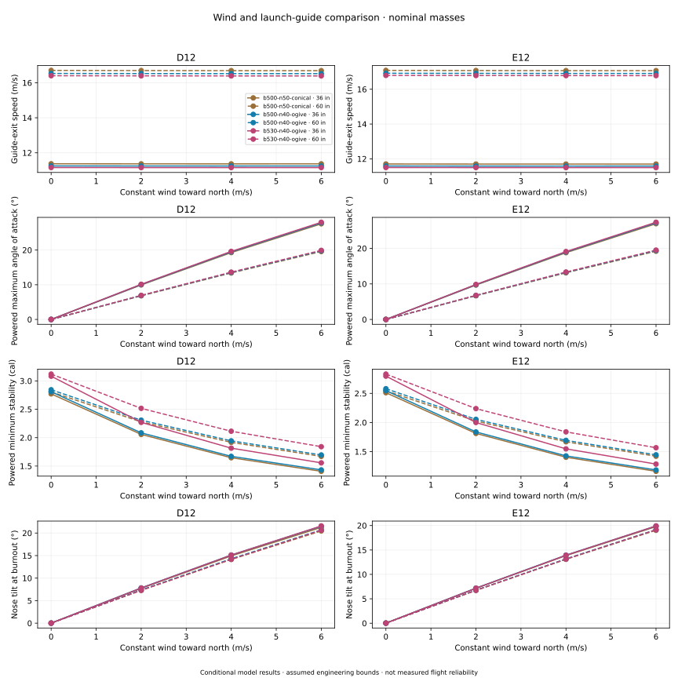
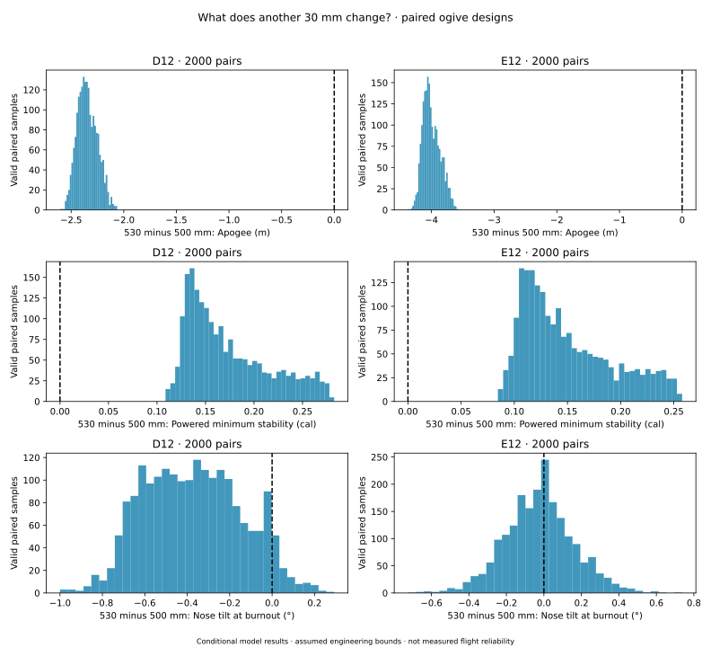
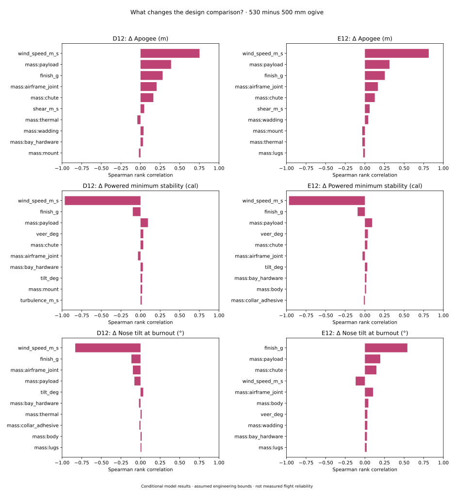
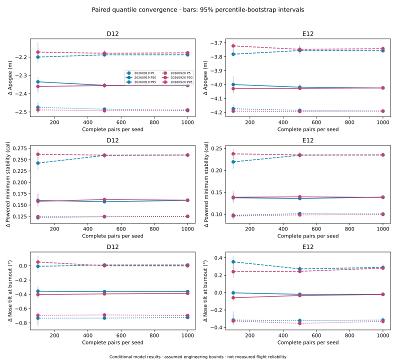
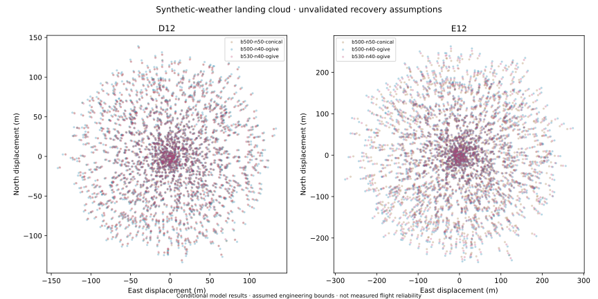
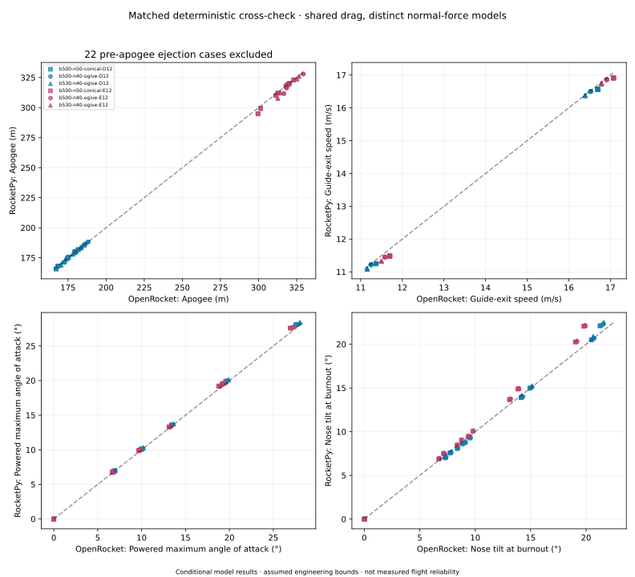

# Flight robustness: what changes in wind?

The next question after the [geometry sweep](PAYLOAD_SWEEP.md) is not simply which rocket flies highest. It is whether a
design responds more favorably to the **same** weather, launcher and construction uncertainties. This study compares the
existing 500 mm / 50 mm conical baseline and the 500 mm and 530 mm / 40 mm ogive candidates, each with the printed
three-fin collar, camera/logger payload, D12-5 and E12-6.

These are conditional engineering experiments—not measured failure probabilities, flight certification, or a maximum
permitted wind speed. Assembled mass, CG, guide fit and recovery still need physical checks.

## Decision summary

**Keep the existing fin collar; favor the 530 mm ogive if its small altitude cost is acceptable.** Its extra stability
separation is a repeatable model benefit. It is not a demonstrated improvement in real-world wind tolerance or vertical
flight. A longer usable launch guide addresses a larger initial-flight weakness, while recovery timing and measured
installed mass/CG remain higher-priority checks than more geometry optimization.

The final campaign contains **12,000 ensemble flights plus 120 deterministic flights**, all completed with no engine
warnings or missing reported metrics. That is not an all-pass result: **all 12,000 sampled 36-inch-guide cases miss the
configured 12 m/s departure screen**. None has powered stability below 1.0 caliber, but some miss the advisory
1.5-caliber cushion and the configured 10 m/s deployment-speed screen:

| Design           | D12 powered <1.5 cal | E12 powered <1.5 cal | D12 deployment >10 m/s | E12 deployment >10 m/s |
| ---------------- | -------------------: | -------------------: | ---------------------: | ---------------------: |
| 500 mm / conical |                  253 |                  820 |                    141 |                    376 |
| 500 mm / ogive   |                  188 |                  783 |                    149 |                    433 |
| 530 mm / ogive   |                   11 |                  507 |                    160 |                    429 |

Each cell is a count out of **2,000 assumed-condition samples** for that design/motor—not a measured failure rate. The
longer body improves the stability cushion but does not resolve guide departure or deployment-speed concerns.

For the ogives, paired **530 minus 500 mm** differences are:

| Motor | Apogee: median [P5, P95] | Powered minimum stability: median [P5, P95] | Burnout tilt: median [P5, P95] |
| ----- | ------------------------ | ------------------------------------------- | ------------------------------ |
| D12-5 | −2.35 m [−2.49, −2.18]   | +0.161 cal [+0.125, +0.260]                 | −0.38° [−0.72, +0.004]         |
| E12-6 | −4.02 m [−4.19, −3.75]   | +0.139 cal [+0.100, +0.235]                 | −0.02° [−0.32, +0.28]          |

These quantiles describe variation across the assumed inputs, not confidence bounds on real flight. The two 1,000-sample
seeds agree on the altitude/stability tradeoff; tiny tilt differences remain model-dependent.

## Read the flight, not just its apogee

- **Angle of attack:** the nose direction relative to the local airflow.
- **Nose tilt:** the nose direction relative to vertical. A rocket can weathercock substantially with low angle of
  attack.
- **Trajectory tilt:** its direction of travel relative to vertical; not necessarily the nose direction.
- **Powered minimum stability:** the smallest modeled CG–CP separation in body diameters after guide exit and before
  burnout, while thrust is positive. It is not the earlier sweep's whole-ascent minimum or a launch static margin.

The powered window deliberately excludes constrained guide motion and near-apogee low-speed behavior. Coast is reported
separately. Unavailable events or nonfinite measurements remain missing, not replaced with favorable values. Incomplete
OpenRocket thrust evidence also invalidates its powered-phase metrics in this report.

[Open the interactive flight viewer](assets/flight-robustness/flight-viewer.html) to compare retained trajectories,
angle of attack, nose tilt and stability. Choose the same scenario for all three designs; guide exit and burnout are
marked. It contains all deterministic traces and the first five ensemble traces per seed—not every sampled flight.

## Wind and launch-guide length



Solid lines use a 36-inch physical guide; dashed lines use 60 inches. The figure shows constant wind toward north; the
dataset also contains perpendicular wind, shear, direction changes with height, turbulence and launcher tilt. The
nominal comparison makes the guide-length effect much larger than the difference among these three airframes: a longer
guide provides more acceleration before the rocket must respond freely to crosswind.

For example, nominal **E12-6 at 4 m/s constant crosswind** gives:

| Ogive body / physical rod | Guide-exit speed | Powered minimum stability | Maximum powered angle of attack | Nose tilt at burnout |
| ------------------------- | ---------------: | ------------------------: | ------------------------------: | -------------------: |
| 500 mm / 36 in            |        11.58 m/s |                  1.43 cal |                          18.96° |               13.94° |
| 530 mm / 36 in            |        11.50 m/s |                  1.55 cal |                          19.09° |               13.92° |
| 500 mm / 60 in            |        16.91 m/s |                  1.69 cal |                          13.24° |               13.18° |
| 530 mm / 60 in            |        16.78 m/s |                  1.84 cal |                          13.34° |               13.13° |

The extra tube buys stability separation, not a meaningful improvement in vertical flight in this case. The longer guide
materially changes the initial crosswind encounter, but does not eliminate weathercocking. These are model comparisons,
not permission to launch in that wind. In particular, these corrected 36-inch guide speeds are **below the
configuration's 12 m/s planning screen**; the absence of an OpenRocket warning does not mean that project screen passes.

**Guide travel matters.** This version explicitly uses OpenRocket's native aft-lug-clearance approximation: physical rod
length minus the distance from the tail to the bottom of the aft lug. The current geometry has approximately 0.7644 m of
usable travel on a 0.9144 m rod, rather than treating the full rod as supported acceleration distance. This is not a
measurement of actual two-lug guidance. The final dataset uses corrected guide travel and explicitly seeded wind levels
for reproducible paired conditions. The modeled guides are still the older 1/8-inch geometry; this comparison does not
establish 3/16-inch fit, rod stiffness, friction or the suitability of a particular launch base.

A separate [six-case heavier-construction check](assets/flight-robustness/long-guide-upper.json) puts every component at
its existing upper estimate, adds 5 g of collar finish, and uses a vertical 60-inch guide in 6 m/s steady crosswind.
Guide exits remain **15.84–16.65 m/s**, but deployment is **10.58–12.02 m/s**: all six exceed the 10 m/s deployment
screen. For E12, powered minimum stability is about 1.47 cal for the cone, 1.49 cal for the 500 mm ogive, and 1.62 cal
for the 530 mm ogive. This supports the longer guide's exit-speed benefit—not a blanket pass. Setting all masses high is
not proof of the worst possible CG arrangement.

## Paired construction and weather experiments

The completed study uses 1,000 shared samples for each of two master seeds, applied to all six design/motor
combinations: 12,000 ensemble flights plus 120 deterministic flights. The
[result summary](assets/flight-robustness/summary.json) records expected, recorded, failed, warned and missing counts
for each group. Plots can be regenerated during a run; their valid sample counts—not the target—determine how much
evidence is present. It also counts departures below the configured 12 m/s minimum, whole-ascent stability below the
configured 1.0-caliber minimum, deployment above the configured 10 m/s maximum, and free-powered stability below 1.0/1.5
cal. The latter 1.5-caliber comparison is an advisory cushion, not a new universal gate. Fractions describe this assumed
sample population, not measured reliability. Missing metrics are never counted as passing.

Independent uniform draws represent **assumed engineering bounds**, not observed distributions:

| Input                                     | Experiment                                                                                    |
| ----------------------------------------- | --------------------------------------------------------------------------------------------- |
| Purchased-component and payload estimates | Interpolate existing nominal-to-upper records; mass and axial station move together           |
| Collar finish                             | 0–5 g added to the measured 27 g raw print                                                    |
| Launch tilt                               | 0–2°, arbitrary heading                                                                       |
| Ground wind                               | 0–6 m/s, arbitrary direction                                                                  |
| Wind change by 500 m AGL                  | −2 to +2 m/s, speed floored at zero; direction change −30° to +30°                            |
| Turbulence parameter                      | 0–0.5 m/s standard deviation per noise generator on independently seeded 10 m altitude levels |

Every paired design receives the same sample identity. This couples construction changes coherently and provides a
common weather realization within OpenRocket. A matching numeric seed in a different simulator would **not** produce the
same gust history. The 10 m level spacing also imposes an assumed vertical gust structure: independent level signals are
blended between heights, changing local variance and correlation. The sampled parameter is **not** a measured local gust
standard deviation. Sensitivity to gust coherence/level spacing is a future model check; more samples of this one field
construction cannot establish it as realistic.

Motor curve/delay variability, independent placement tolerances, fin misalignment and aerodynamic-model error are not
sampled: usable empirical bounds are missing. Chute drag coefficient remains the inherited 0.53 proxy, not a
characterization of the selected plastic Estes chute. Inertias are component-model approximations, not measurements of
installed electronics. More samples cannot fix those omissions.



Values are **530 minus 500 mm**. Positive stability means more modeled separation; negative apogee means lost altitude;
negative tilt means a more vertical nose at burnout. A distribution spanning zero means the direction of that difference
depends on the sampled conditions—not that the two rockets are identical.



These are descriptive Spearman rank correlations, not causal variance attribution. Coupled mass/station changes,
nonlinear interactions, angular inputs and unmodeled errors limit interpretation. A small correlation does not establish
that an input is unimportant. The [absolute angle-of-attack sensitivity](assets/flight-robustness/sensitivity.svg)
answers a different question: what changes that metric for the 530 mm design itself?

## Sampling uncertainty and landing location



Each seed is evaluated at prefixes of 100, 500 and 1,000 pairs. Curves show P5, median and P95; bars are 95%
percentile-bootstrap intervals from 600 fixed-seed resamples. A prefix is plotted only when all its metric pairs are
available. Missing/failed pairs remain in summary denominators. These intervals quantify sampling variation under the
assumed input model—not uncertainty in the flight-physics model or real-world safety.

[Numerical verification](assets/flight-robustness/verification.json) retains timestep comparisons and same-seed
turbulence repeats. Numerical sensitivity must also be compared with a proposed design benefit: a tiny tilt difference
is not persuasive if timestep changes or another aerodynamic model move the result by more. Across nominal calm, nominal
6 m/s wind, and each design's lowest sampled stability case, reducing maximum timestep from 0.01 to 0.0025 s changed
apogee by at most 0.034 m, guide speed 0.176 m/s, powered minimum stability 0.0102 cal, maximum powered angle of attack
0.368°, and burnout tilt 0.022°. Same-seed turbulent repeats matched within the recorded numerical tolerance. This
bounds the tested numerical sensitivity, not the underlying model error.



The cloud follows synthetic weather profiles and uncertain mass, with a fixed recovery model. It is neither a forecast
for a launch day nor a site-clearance recommendation. Imported real wind profiles must carry location, timestamp, units
and AGL/MSL reference; complete profiles are retained rather than independently randomizing layers. Atmospheric profiles
also do not resolve local gusts behind buildings or terrain.

## What adds confidence next?

1. Weigh the finished, fully assembled rocket and locate CG with each loaded motor; record component stations.
2. Check usable guide travel and friction, recovery extraction, camera field of view and bay sealing.
3. Use actual site weather profiles alongside conservative local wind measurements.
4. Compare an instrumented flight with the recorded model before treating narrow simulation differences as decisive.

The [current-design render and CFD review](CFD_LATEST_DESIGN.md) is complementary. It does not supply validated drag
corrections here. Tiny camera/pressure-port differences require resolved geometry and a converged differential CFD
study; an attractive streamline image is not aerodynamic validation.

## Why use two flight tools?

| Tool                        | Role here                                                                                     | Important limitation                                                                                  |
| --------------------------- | --------------------------------------------------------------------------------------------- | ----------------------------------------------------------------------------------------------------- |
| OpenRocket 24.12            | Primary design model, paired weather/construction experiments, native component aerodynamics  | Conventional components approximate the custom collar and payload; ports and fillets are not resolved |
| RocketPy                    | Independent motion integration and nose/fin normal-force calculation through ballistic apogee | Shares OpenRocket's calm-flight drag curves; no recovery or landing cross-validation                  |
| Our experiment/report layer | Reproducible sample identities, uncertainty bookkeeping, paired comparisons and plots         | It adds analysis, not a newly validated flight-physics engine                                         |

The cross-check matches audited mass, CG, inertia, thrust/mass curves, atmosphere and effective guide travel. RocketPy's
CP calculation as a function of Mach and OpenRocket's angle-dependent CP are not interchangeable definitions of dynamic
stability. Turbulent cases are excluded from cross-engine comparison because an equivalent gust realization has not been
implemented. Agreement helps check inputs and integration; disagreement can expose model limitations. Neither is a
substitute for measured flight data.

The RocketPy comparison stops at ballistic apogee, with recovery disabled. Its normal-force model becomes numerically
problematic in the tested reverse-flow descent condition; it is not a recovery validation tool here. Any planned
ejection before ballistic apogee is flagged because that case's recovery-disabled apogee is not directly equivalent to
OpenRocket's deployed trajectory. RocketPy deployment and landing metrics remain unavailable.

All **108 matched, nonturbulent cases completed** without engine warnings. In **22 cases**, scheduled ejection precedes
ballistic apogee: their apogees are excluded from the direct equality comparison, but their powered-flight metrics
remain usable. [Cross-check coverage and differences](assets/flight-robustness/rocketpy-summary.json) retain those
exclusions explicitly.



Comparable calm apogees agree within 0.007 m, largely a check of shared inputs and integration—not an independent drag
prediction. At 6 m/s crosswind, E12 apogees differ by as much as 5 m and burnout nose tilt by 2.3°. Both tools retain
the roughly 4 m E12 / 2.5 m D12 altitude penalty for another 30 mm of tube. They do **not** consistently agree on
whether that extra tube makes the nose more vertical: at 4 m/s crosswind on E12 with the 36-inch rod, OpenRocket
predicts 0.015° less tilt and RocketPy 0.011° more. That tiny design difference is not strong evidence of a practical
wind-performance advantage.

## Reproduce and inspect

Install the tested Java runtime described in the [local setup](../README.md#setup). To generate a fresh campaign (do not
overwrite the retained evidence), run:

```sh
uv sync --frozen --extra cad --extra analysis --group dev
uv run --frozen --no-sync python scripts/bootstrap.py
PYTHONPATH=src:scripts uv run --frozen --no-sync python scripts/study_robustness.py \
  --output runs/robustness-reproduction --phase prepare --count 1000
PYTHONPATH=src:scripts uv run --frozen --no-sync python scripts/study_robustness.py \
  --output runs/robustness-reproduction --phase deterministic
PYTHONPATH=src:scripts uv run --frozen --no-sync python scripts/study_robustness.py \
  --output runs/robustness-reproduction --phase ensemble --seed 20260919 --count 1000
PYTHONPATH=src:scripts uv run --frozen --no-sync python scripts/study_robustness.py \
  --output runs/robustness-reproduction --phase ensemble --seed 20260920 --count 1000
PYTHONPATH=src:scripts uv run --frozen --no-sync python scripts/verify_robustness.py \
  --output runs/robustness-reproduction
PYTHONPATH=src:scripts uv run --frozen --no-sync python scripts/check_long_guide.py \
  --study runs/robustness-reproduction
PYTHONPATH=src:scripts uv run --frozen --no-sync python scripts/crosscheck_rocketpy.py \
  --output runs/robustness-reproduction --label rocketpy-ascent
```

For parallel workers, use disjoint `--model` selections with the study's exact model identifiers. Never run two workers
against the same output model/phase. A deterministic `--wind-profile path/to/profile.json` adds measured profile cases.
Verification should be rerun after the campaign to include its lowest-stability sampled cases.

Retained `.ork` files preserve geometry and mass. Reproducing the **paired multi-level turbulence** requires the script
and sample manifest: altitude-level noise seeds are installed in memory by the pinned 24.12 adapter. Merely opening the
file and clicking Run in the GUI does not reproduce that seeded realization.

To regenerate plots from this report's retained campaign:

```sh
uv run --frozen --no-sync python scripts/plot_robustness.py \
  --input runs/robustness-20260919-v5 \
  --rocketpy runs/robustness-20260919-v5/rocketpy-ascent \
  --require-complete \
  --output docs/assets/flight-robustness
```

The renderer does not run simulations. It requires final schema 4 (corrected guide travel and seeded wind levels),
rejects duplicate sample identities, and checks saved inputs against the frozen shared sample manifest. For interim
reports, omit `--require-complete` and select a separate output folder; an unfinished final JSONL line is tolerated
while a run is active. [Per-flight metrics](assets/flight-robustness/flights.csv),
[summary statistics](assets/flight-robustness/summary.json), and
[source/output hashes](assets/flight-robustness/provenance.json) retain scope and provenance; full models, samples,
events and available time histories remain in the run directory.
