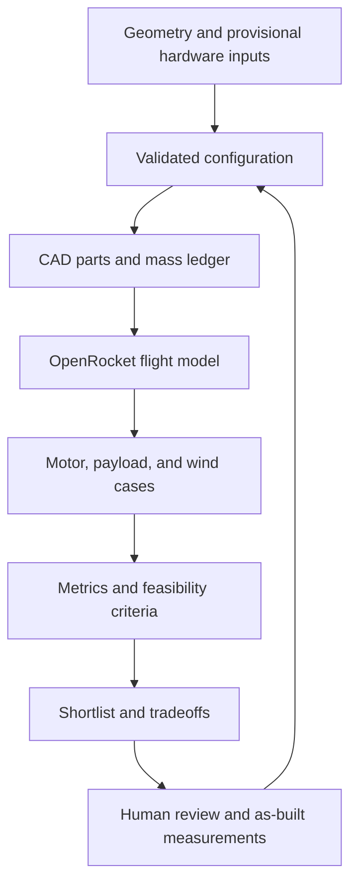

# Rocket Workbench

Reproducible model-rocket geometry, CAD exports, OpenRocket simulations, and design comparisons.

**Simulation evidence only: provisional hardware inputs, no physical validation or flight approval.**

Use the navigation to read the review, inspect plots, or follow the build and measurement guides.

The loop represents the development workflow, not automated approval for physical flight.
