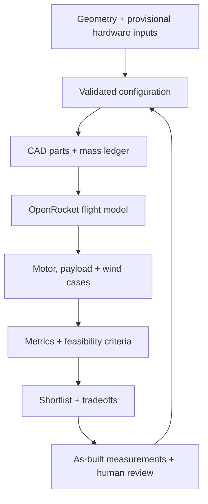

---
hide:
  - navigation
  - toc
  - path
---

  <section class="rw-hero" aria-labelledby="rw-hero-title">
    
    

    

      
MODEL ROCKET DEVELOPMENT / REPRODUCIBLE EVIDENCE

      <h1 id="rw-hero-title">Rocket Workbench</h1>
      

        Parametric CAD, OpenRocket flight studies, and bounded CFD—kept together so every design decision can be inspected and reproduced.
      

      

        Not flight-cleared
        D12-5 / BT-60
        OpenRocket 24.12
        OpenFOAM v2512
      

      

        <a class="rw-button rw-button--primary" href="docs/CURRENT_DESIGN/">Current design</a>
        <a class="rw-button" href="docs/BUILD/">Build and hardware</a>
      

    

    
Velocity-colored streamlines from the retained swept-fin OpenFOAM case

  </section>

  <section class="rw-summary" aria-label="Current engineering status">
    <article class="rw-card">
      
Current platform

      
D12-5 / BT-60

      
Passive clipped-delta configuration with a 500 mm body, removable avionics bay, organic fin-collar v2, and 192/192 simulated D12 cases meeting the earlier bounded screens.

    </article>
    <article class="rw-card">
      
Stock-pad finding

      
11.43–11.51 m/s

      
The 30-inch rod misses the project’s 12 m/s guide-departure screen across every 30–50 mm nose tested.

    </article>
    <article class="rw-card">
      
Next physical gate

      
Measure, fit, verify

      
Use a stiffer 36-inch guide, then measure assembled mass, balance, retention, and recovery packing.

    </article>
  </section>

  <section class="rw-copy">
    

      
CURRENT DECISION

      <h2>The small pad can stay. The stock rod should not.</h2>
    

    

      

        The Porta-Pad II base accepts Estes’ 36-inch, 3/16-inch Maxi rod. The current printed lug sleeves assume 1/8-inch paper lugs, so both lugs must be resized or replaced together and checked for free, coaxial travel on the actual rod.
      

      

        The commercial 24 mm motor mount remains bonded inside the paper BT-60 tube; the printed fin collar bonds around the tube and does not retain the motor.
      

      

        <a href="docs/MEASUREMENTS/">Measurement checklist →</a>
        <a href="docs/SHOPPING/">Hardware and sourcing →</a>
        <a href="docs/FIN_COLLAR_V2/">Fin-collar v2 →</a>
        <a href="runs/d12-nose-length-screen-20260916/report/">30–50 mm nose screen →</a>
      

    

  </section>

## Evidence loop

The loop is the development workflow—not automated approval for physical flight. CFD remains exploratory until its
validation gates pass.

[Browse archived and superseded studies](ARCHIVE.md)
