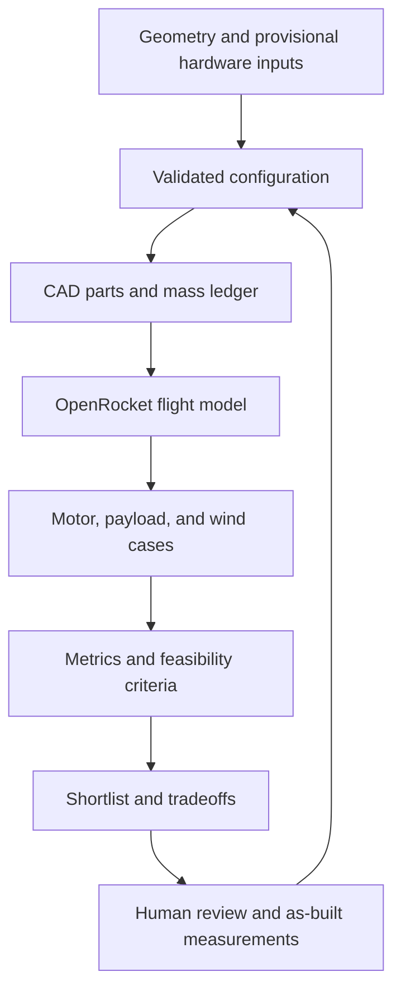

# Rocket Workbench

Reproducible model-rocket geometry, CAD exports, OpenRocket simulations, and design comparisons.

**Simulation evidence only: provisional hardware inputs, no physical validation or flight approval.**

Start with [current D12 designs and review files](CURRENT_DESIGN.md): performance tradeoffs, uncertainty results, CAD
and the matching X1C project. The integrated 24-inch recovery / insert-bay candidate predicts approximately 145–187 m
loaded altitude and passes all 192 planned dummy/logger cases in its bounded uncertainty study. This is not a
reliability probability, global optimum or flight clearance. The 22-inch / 460 mm alternative offers less modeled drift;
see the comparison before choosing hardware. CFD remains unaccepted for design selection.

Use the [D12 build guide](BUILD.md), [sourced hardware](SHOPPING.md) and [current progress](PROGRESS.md). Superseded
C5-3 results and V5 downloads live in the [old-news archive](ARCHIVE.md), not the current shortlist.

The loop represents the development workflow, not automated approval for physical flight.
