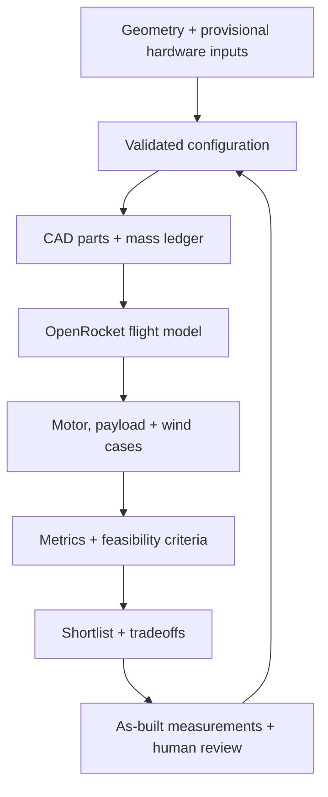

---
hide:
  - toc
  - path
---

  <section class="rw-hero" aria-labelledby="rw-hero-title">
    
    

    

      
MODEL ROCKET DEVELOPMENT / REPRODUCIBLE EVIDENCE

      <h1 id="rw-hero-title">Rocket Workbench</h1>
      

        Parametric CAD, OpenRocket flight studies, and bounded CFD—kept together so every design decision can be inspected and reproduced.
      

      

        Not flight-cleared
        D12-5 / BT-60
        OpenRocket 24.12
        OpenFOAM v2512
      

      

        <a class="rw-button rw-button--primary" href="docs/CURRENT_DESIGN/">Current design</a>
        <a class="rw-button" href="docs/BUILD/">Build hardware</a>
      

    

    
Velocity-colored streamlines from the retained swept-fin OpenFOAM case

  </section>

<section class="rw-summary" aria-label="Current engineering status">
  <article class="rw-card">
    
Current platform

    
D12-5 / E12-6 · BT-60

    
500 mm body, integrated fin collar, removable camera/logger bay. The raw collar print weighs 27 g.

  </article>
  <article class="rw-card">
    
Launch guide

    
3/16-inch Maxi rod

    
Matching rocket guides still need to be built and checked on the actual rod.

  </article>
  <article class="rw-card">
    
Flight-model status

    
Provisional

    
Both motors pass the current numerical screen, but finished mass, CG and recovery must be verified.

  </article>
</section>

<section class="rw-copy">
  

    
CURRENT BUILD

    <h2>The printed collar is real; the assembled rocket is not yet measured.</h2>
  

  

    
The next gates are a dry fit of the two-tube airframe and coupler, a 3/16-inch guide interface, recovery packing and extraction, then measured mass and CG in a fresh D12-5/E12-6 simulation.

    

      <a href="docs/CURRENT_DESIGN/">Current configuration →</a>
      <a href="docs/MEASUREMENTS/">Measurement checklist →</a>
      <a href="docs/SHOPPING/">Hardware sourcing →</a>
      <a href="docs/INTEGRATED_FIN_COLLAR/">Fin collar →</a>
    

  

</section>

## Evidence loop

This loop is a development workflow—not automated approval for physical flight. CFD remains exploratory until its
validation gates pass.

[Browse archived and superseded studies](ARCHIVE.md)
