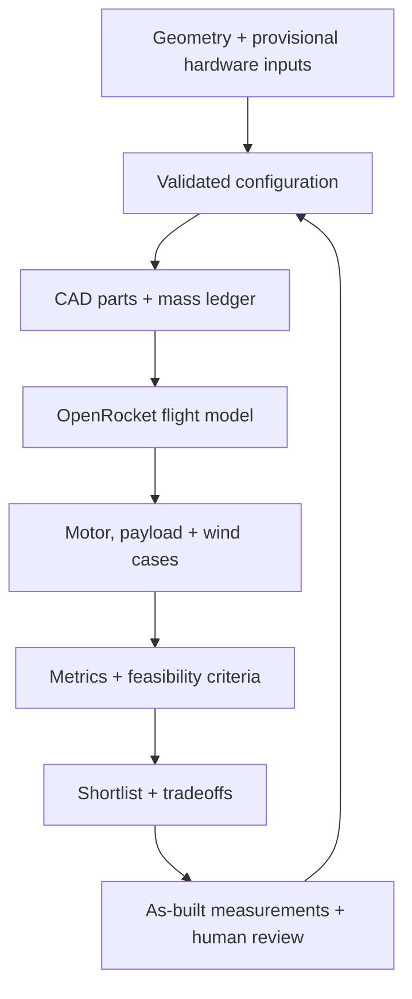

---
hide:
  - toc
  - path
---

  <section class="rw-hero" aria-labelledby="rw-hero-title">
    
    

    

      
MODEL ROCKET DEVELOPMENT / REPRODUCIBLE EVIDENCE

      <h1 id="rw-hero-title">Rocket Workbench</h1>
      

        Parametric CAD, OpenRocket flight studies, and bounded CFD—kept together so every design decision can be inspected and reproduced.
      

      

        Not flight-cleared
        D12-5 / BT-60
        OpenRocket 24.12
        OpenFOAM v2512
      

      

        <a class="rw-button rw-button--primary" href="docs/CURRENT_DESIGN/">Current design</a>
        <a class="rw-button" href="docs/BUILD/">Build hardware</a>
      

    

  
500 mm ogive comparison candidate · exploratory CFD · guides and ports omitted

  </section>

<section class="rw-summary" aria-label="Current engineering status">
  <article class="rw-card">
    
Current platform

    
D12-5 / E12-6 · BT-60

    
Recommended: 530 mm body, 40 mm ogive, existing 27 g fin collar and camera/logger payload. Not yet an as-built configuration.

  </article>
  <article class="rw-card">
    
Launch guide

    
Longer usable guide

    
The 36-inch cases miss our 12 m/s departure screen. A 60-inch guide improves exit speed; diameter, stiffness, fit and friction still need checking.

  </article>
  <article class="rw-card">
    
Flight-model status

    
12,120 flights studied

    
More stability margin for little altitude cost—not an all-pass result. Windy, heavier cases still exceed the deployment-speed screen.

  </article>
</section>

<section class="rw-copy">
  

    
LATEST RESULTS

    <h2>Keep the collar. Buy margin with length. Verify launch and recovery.</h2>
  

  

    
The 530 mm ogive gains about 0.16 caliber on D12 and 0.14 on E12, costing only 2.35 m and 4.02 m of altitude versus the 500 mm ogive. Better wind handling is not established. Next: measured mass/CG, a compatible longer guide, and recovery verification.

    

      <a href="docs/FLIGHT_ROBUSTNESS/">Final robustness report →</a>
      <a href="docs/CURRENT_DESIGN/">Current configuration →</a>
      <a href="docs/MEASUREMENTS/">Measurement checklist →</a>
      <a href="docs/SHOPPING/">Hardware sourcing →</a>
      <a href="docs/INTEGRATED_FIN_COLLAR/">Fin collar →</a>
    

  

</section>

## Evidence loop

This loop is a development workflow—not automated approval for physical flight. CFD remains exploratory until its
validation gates pass.

[Browse archived and superseded studies](ARCHIVE.md)
