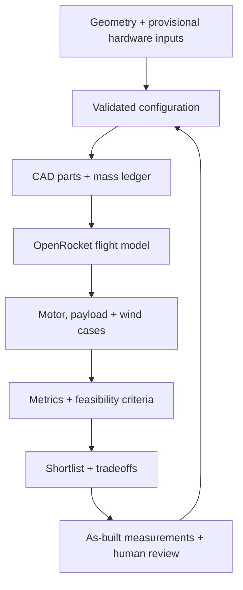

---
hide:
  - toc
  - path
---

  <section class="rw-hero" aria-labelledby="rw-hero-title">
    
    

    

      
MODEL ROCKET DEVELOPMENT / REPRODUCIBLE EVIDENCE

      <h1 id="rw-hero-title">Rocket Workbench</h1>
      

        Parametric CAD, OpenRocket flight studies, and bounded CFD—kept together so every design decision can be inspected and reproduced.
      

      

        Not flight-cleared
        D12-5 / BT-60
        OpenRocket 24.12
        OpenFOAM v2512
      

      

        <a class="rw-button rw-button--primary" href="docs/CURRENT_DESIGN/">Current design</a>
        <a class="rw-button" href="docs/BUILD/">Build hardware</a>
      

    

    
Velocity-colored streamlines from the retained swept-fin OpenFOAM case

  </section>

  <section class="rw-summary" aria-label="Current engineering status">
    <article class="rw-card">
      
Current platform

      
D12-5 / BT-60

      
Passive clipped-delta configuration, 500 mm body, removable avionics bay, and organic fin-collar v2.

    </article>
    <article class="rw-card">
      
Selected launch guide

      
36 × 3/16 inches

      
Estes’ two-piece <a href="https://estesrockets.com/products/3-16-two-piece-maxi-launch-rod">Maxi rod</a> fits the existing <a href="https://estesrockets.com/products/porta-pad-ii-launch-pad">Porta-Pad II</a> and provides a longer, stiffer guide.

    </article>
    <article class="rw-card">
      
Modeled guide departure

      
12.91–12.92 m/s

      
The current loaded cases clear the project’s 12 m/s screen on the 36-inch guide.

    </article>
  </section>

  <section class="rw-copy">
    

      
CURRENT LAUNCH SETUP

      <h2>The pad stays. The guide gets longer and stiffer.</h2>
    

    

      

        The stock 1/8-inch rod lifts out of the Porta-Pad II and the two-piece 3/16-inch Maxi rod installs in the same pad. Two aligned launch lugs keep the rocket pointed on the selected path while the D12 builds enough airspeed for the fins to take over.
      

      

        The current simulation predicts 12.91–12.92 m/s at guide departure. That is a useful modeled margin, not flight clearance: the printed lug sleeves still need to be resized from 1/8 inch, and the assembled rocket must slide freely over the straight, clean rod with both lugs coaxial. Actual usable guide travel, loaded mass, balance, wind, and pad setup remain physical checks.
      

      

        <a href="docs/CURRENT_DESIGN/">Current configuration →</a>
        <a href="docs/MEASUREMENTS/">Measurement checklist →</a>
        <a href="docs/SHOPPING/">Hardware sourcing →</a>
        <a href="docs/FIN_COLLAR_V2/">Fin-collar v2 →</a>
      

    

  </section>

## Evidence loop

This loop is a development workflow—not automated approval for physical flight. CFD remains exploratory until its
validation gates pass.

[Browse archived and superseded studies](ARCHIVE.md)
