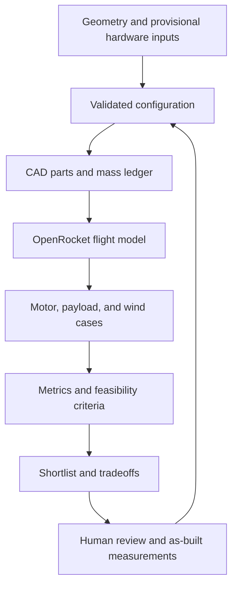

# Rocket Workbench

Reproducible model-rocket geometry, CAD exports, OpenRocket simulations, and design comparisons.

**Simulation evidence only: provisional hardware inputs, no physical validation or flight approval.**

Start with [current avionics designs and downloads](CURRENT_DESIGN.md): corrected hardware-specific simulations,
performance tradeoffs, stress limits, CAD and the V5 X1C project. The loaded leader predicts roughly 58–60 m on C5-3; no
design clears the full uncertainty envelope. See the [next platform decision](NEXT_PLATFORM.md) before ordering for
higher performance. Superseded results live in the [old-news archive](ARCHIVE.md), not the current shortlist.

The loop represents the development workflow, not automated approval for physical flight.
