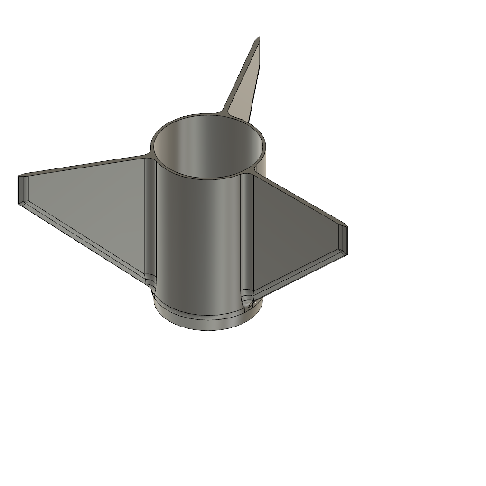

# Current fin collar print candidate

> **Print measurement, 2026-09-19:** The user's print is 27 g with a little brim remaining. This supersedes the
> STEP-density estimate for the raw collar mass, not for its unmeasured axial CG or future primer/paint mass. See
> [measurements](MEASUREMENTS.md) and the [updated D/E screen](DE_GEOMETRY_SWEEP.md).

This is the current one-piece printed fin collar, with three integrated fins and blended roots. It supersedes the
earlier v3 parametric collar as the physical development part, but it is not yet a flight-qualified component.

## Files

- [Editable CAD archive](assets/integrated-fin-collar-v1/collar-fins.f3d)
- [Authoritative STEP solid](assets/integrated-fin-collar-v1/collar-fins.step)
- [Bambu-import STL](assets/integrated-fin-collar-v1/collar-fins.stl), tessellated from that STEP at 0.01 mm linear
  tolerance
- [Unsliced X1C project](assets/integrated-fin-collar-v1/integrated-fin-collar-X1C-PLA-review.3mf)
- [SHA-256 manifest](assets/integrated-fin-collar-v1/SHA256SUMS)

The STEP is one valid, watertight solid. Its axial bounds are 478.143–550.000 mm, volume is 23,760.391 mm³, and its CAD
center of mass is Z = 522.285 mm in the project nose-tip datum. It shares the v3 collar's axial envelope; its solid
volume is 2.5% greater and its CAD CG is 1.23 mm farther aft. Those are provisional CAD comparisons, not printed-part
measurements.

## Print project

Open the **unsliced** project and select the installed red **Bambu PLA Basic** spool before printing. It was generated
with Bambu Studio 02.08.02.61 for an X1 Carbon with a 0.4 mm nozzle:

| Setting      | Value            | Why                                                                               |
| ------------ | ---------------- | --------------------------------------------------------------------------------- |
| Orientation  | Aft end down     | Largest stable collar contact area; preserves the established collar orientation. |
| Layer height | 0.20 mm          | Ten layers through the 2 mm nominal fin thickness; a sound fit/strength baseline. |
| Wall loops   | 4                | Root and fin strength depend more on continuous perimeters than sparse fill.      |
| Infill       | 40% gyroid       | Structural support without the mass, time, and shrink stress of 100% fill.        |
| Supports     | Build plate only | Required by the slicer; inspect their contact around the roots before printing.   |
| Brim         | 5 mm outer-only  | Extra adhesion margin for the tall, three-fin part.                               |
| Plate        | Textured PEI     | Matches the existing X1C print-review workflow.                                   |

The saved 3MF is an unsliced project. Its settings and archive integrity are checked, but this does **not** verify that
BambuStudio can complete a slice. Open it, confirm the installed red Bambu PLA Basic profile, click **Slice plate**, and
inspect the preview (especially supports, outer fin edges, and root transitions) before printing. No printer command was
sent. Do not reduce the brim or walls for the first functional print. A 0.16 mm layer variant is reasonable later for a
more cosmetic surface, but it is not expected to make the fin roots stronger.

## Before flight-model update

Measure the finished collar's mass and its axial CG from the assembled nose tip, check bore fit on the real BT-60, check
all three fins for alignment and root defects, and perform a representative strength/adhesion check. Then update the
`fin-collar` measurement and rerun the selected spliced-airframe OpenRocket configuration. See
[re-verification](REVERIFICATION.md) and [measurements](MEASUREMENTS.md).
