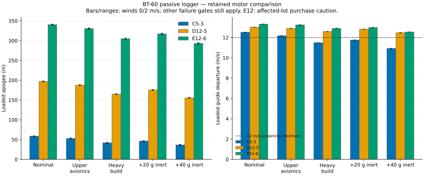

# 24 mm motors in BT-60: first comparison

**405 completed simulations; no flight clearance.** This is a bounded comparison of Estes C11, D12 and E12 delays, not
every commercial 24 mm motor. Composite alternatives are not evaluated. The airframe stays BT-60: 50 mm cone, 410 mm
body, 45 mm fins, 145 mm bay and 18-inch chute. No active-control system is included.

## Recommendation

**Develop D12-5 / BT-60 next, before buying a wider tube.** It offers substantially more predicted altitude and payload
margin than C5-3, with lower performance and recovery-area demands than E12. It is not flight-ready. V5 remains the 18
mm print/review package; no new 24 mm print project has been approved.

| Motor                | Loaded nominal apogee |   Powered speed | Minimum guide speed | Estimated powered load | Loaded +40 g apogee |
| -------------------- | --------------------: | --------------: | ------------------: | ---------------------: | ------------------: |
| C5-3, 18 mm baseline |         57.62–59.50 m | 22.95–23.10 m/s |           12.51 m/s |          11.66–11.67 g |       35.26–37.57 m |
| D12-5, 24 mm         |       196.07–197.85 m | 63.12–63.27 m/s |           13.02 m/s |          15.08–15.09 g |     154.51–156.61 m |
| E12-6, 24 mm         |       339.30–342.00 m | 87.80–87.94 m/s |           13.32 m/s |                15.57 g |     291.27–294.91 m |

Ranges are winds 0/2 m/s with the current passive logger installed. Extra 40 g is hypothetical inert mass at the
existing payload CG, **not modeled or fitted servo hardware**. Greater altitude is not the same as a pass.



With upper avionics mass, D12-5 predicts 186.72–188.58 m. Combining upper avionics, 20% heavier prints and 50% heavier
mount gives 163.79–165.70 m. Its loaded wind-0/2 cases meet numeric checks in all five mass scenarios; guide margin
remains modest. No motor/delay passes every loading/wind/mass combination.

## Important failures and tradeoffs

- Empty is not automatically safer: nominal D12-5 fails empty wind-2 stability (0.65 cal). E12-6 fails empty winds 0/2
  (about 0.48/0.51 cal). The minimum includes the full post-guide ascent, including low-speed portions.
- Nominal loaded wind-4 stability narrowly fails on D12-5 (0.979 cal), and is 0.793 cal on E12-6.
- C11-3/-5 exceed their delay-specific manufacturer liftoff-mass limits in every modeled case. Simulations completing
  does not override those limits.
- D12-3 and E12-4 deploy too early/fast at nominal mass, around 20 m/s. D12-7 and E12-8 deploy too late/fast.
- Nominal loaded wind-2 landing displacement is about 50 m for D12-5 and 89 m for E12-6. These are scenario outputs, not
  guaranteed recovery radii or site approvals.
- Empty D12/E12 cases reach about 16.8/17.2 g sampled estimated powered load. The table's loaded values do not establish
  a 16 g sensor margin; vibration, deployment and impact shocks are not represented.
- Printed fin roots, bonded joints, mount retention and launch guide are not physically qualified for the increased
  loads/speeds. Unchanged external geometry is not strength validation.

Next checks: evaluate the existing larger-fin option and realistic flight loading for D12-5; measure mount/retention and
recovery packing; extend uncertainty to payload CG, parachute Cd, motor variability and guide conditions. Do not add
ballast solely to make one simulated stability metric pass.

## Explicit modeling changes and limits

This **new** comparison drops the inherited 120 m maximum. The 30 m minimum, guide speed, stability, deployment, descent
and manufacturer mass checks are unchanged. Site altitude and drift boundaries remain unassessed. Historical results
keep their original criteria and pass counts.

The 18 mm baseline retains its mount. Both 24 mm variants use a provisional 95 mm long commercial-mount envelope, ID/OD
24.1/24.8 mm, with a 12 g assembly allowance. C11/D12 add a 1 g removable spacer allowance at its estimated CG; E12 does
not. These are estimates, not measured kit dimensions or fabrication instructions. The spacer is lumped in mount
mass/CG, not separately modeled as a printed part. Nominal loaded dry mass is 162.15 g for C11/D12 and 161.15 g for E12,
versus 157.15 g for C5. Each motor's mass comes separately from its pinned engine curve.

The long mount leaves only **10.87 mm** between the modeled chute bundle and mount, including the 10 mm provisional
wadding allowance. This is not proof of usable packing volume or a wadding-quantity instruction. Follow component
packing instructions and check the real assembly.

Five scenarios: nominal avionics (20.65 g), upper avionics (29.20 g), combined heavy build, and nominal plus 20/40 g
inert mass. Each uses empty/dummy/actual at constant winds 0/2/4 m/s. Dummy and actual are identical mass/CG surrogates,
not independent measurements. Extra hardware fit is not established by the existing avionics fit proof. The current
chute Cd, payload CG and guide remain fixed; this is not a full uncertainty sweep or reliability estimate.

## Evidence and downloads

- [All motor/delay and mass comparisons](../runs/motor24-bt60-20260913/report.md)
- [Comparison JSON](../runs/motor24-bt60-20260913/comparison.json), [CSV](../runs/motor24-bt60-20260913/comparison.csv),
  [study specification](../runs/motor24-bt60-20260913/search-spec.json)
- [D12/C11 nominal configuration](../runs/motor24-bt60-20260913/bt60-24-cd-nominal/config.yaml),
  [complete STEP](../runs/motor24-bt60-20260913/bt60-24-cd-nominal/cad/assembly.step),
  [loaded D12-5 wind-2 ORK](../runs/motor24-bt60-20260913/bt60-24-cd-nominal/actual-D12-5-wind2.ork),
  [time histories and checks](../runs/motor24-bt60-20260913/bt60-24-cd-nominal/results.json)
- [E12 nominal configuration](../runs/motor24-bt60-20260913/bt60-24-e-nominal/config.yaml),
  [complete STEP](../runs/motor24-bt60-20260913/bt60-24-e-nominal/cad/assembly.step),
  [loaded E12-6 wind-2 ORK](../runs/motor24-bt60-20260913/bt60-24-e-nominal/actual-E12-6-wind2.ork),
  [time histories and checks](../runs/motor24-bt60-20260913/bt60-24-e-nominal/results.json)

All local case directories also contain CAD, resolved inputs, normalized flight models, mass ledgers, raw results,
reports and hash manifests. All 405 flights completed and 1,879 artifact-hash entries were checked. Regression tests
verify family-specific dimensions, exact curve identity, native 24 mm mass and saved motor/delay identity. Existing 18
mm inputs remain compatible.

## Sources and purchase caution

[D12-5 specifications](https://estesrockets.com/products/d12-5-engines) list a 283 g maximum liftoff mass. Simulation
uses older bundled NAR-derived curves, not advertised nominal impulse or measured current inventory. Exact curve digests
and thrust/mass histories are retained; current thrust, mass and delay variability remain unmeasured.

The dated [platform price examples](NEXT_PLATFORM.md) show roughly $5 per C5 versus $8 per D12, before shipping, plus a
$11.99 [commercial D/E mount kit supporting BT-60](https://estesrockets.com/products/d-and-e-engine-mount-kit). This is
not a complete delivered upgrade BOM.

**E12 results are not a purchase recommendation.** Check the
[Estes E12 service bulletin](https://estesrockets.com/pages/e12-service-bulletin), including affected lots
`2K1 25336 00` and `2I3 25303 00`, and contact Estes about affected inventory.

## Reproduce

```sh
uv run --extra cad python scripts/study_motor24.py --output runs/new-motor24-bt60
uv run python scripts/plot_motor24.py --study runs/new-motor24-bt60 --output plots/new-motor24-bt60.svg
uv run pytest --run-integration -q
```

Use a new output directory. No purchases, printer commands or physical validation were performed.
