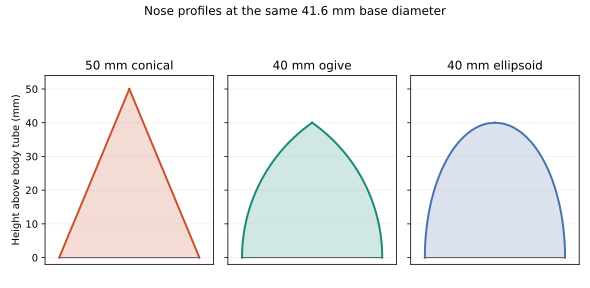
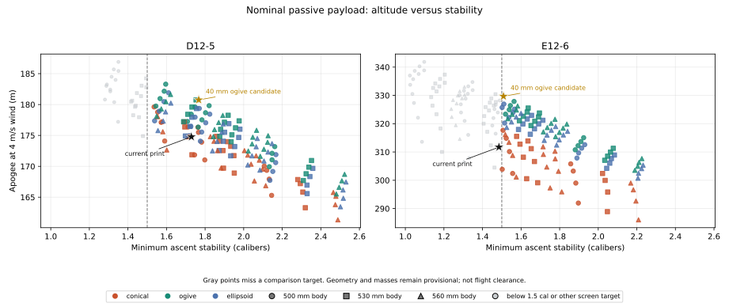
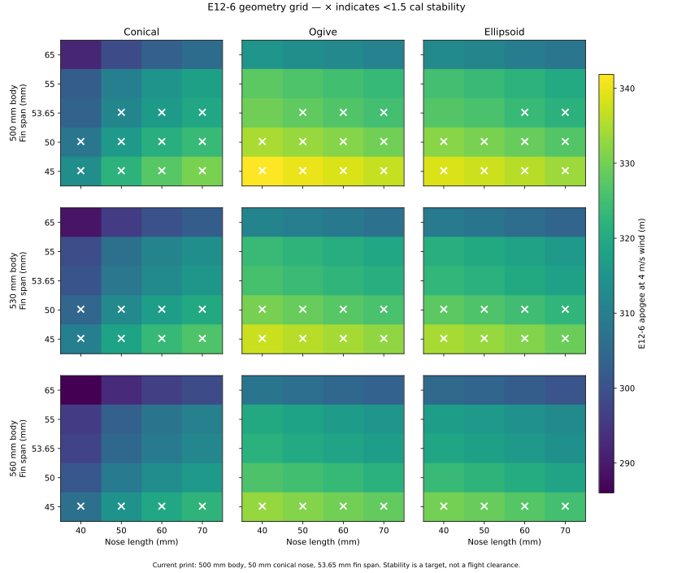
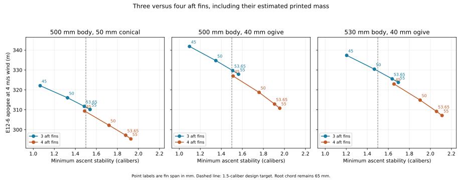
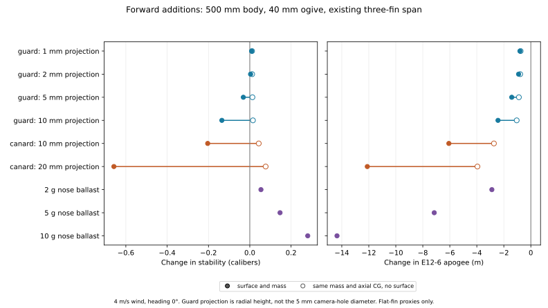
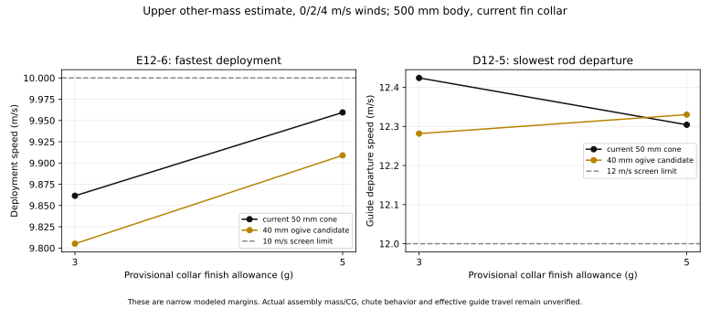

# Payload design tradeoffs

The existing three-fin collar is worth keeping. For the defined camera/logger payload, a **40 mm ogive nose** is the
best nose to investigate next. A **500 mm body** gives the highest E12-6 altitude among the main grid's candidates
meeting the 1.5-caliber comparison target. A **530 mm body** buys useful stability margin for a small altitude cost.
Four fins are a viable alternative, but do not outperform the existing collar on both altitude and stability. Fixed
canards reduce passive stability; a tiny camera guard is a much smaller aerodynamic change.

These are conditional design comparisons. Only the raw collar (27 g) and raw XIAO Sense/camera/antenna (6 g) have been
weighed. The other installed masses, axial CGs, parachute behavior and packaging remain estimates. The
[current physical baseline](CURRENT_DESIGN.md) is still the 500 mm body, 50 mm conical nose and printed collar.

For wind response and launcher decisions, use the newer [flight-robustness study](FLIGHT_ROBUSTNESS.md).
It compares these finalists under paired conditions and corrects guide travel for the aft-lug offset.
The historical sweep below remains a preliminary geometry comparison; its whole-ascent stability metric and
uncompensated guide-departure speeds are not interchangeable with the newer free-powered-flight results.

An **ogive** has pointed, smoothly curved sides, roughly like a bullet. A cone has straight sides; an ellipsoid has a
rounded tip. The profiles below use the same base diameter and the lengths discussed in this report.

## Choices worth considering

All rows below use the existing **three fins, 53.65 mm span and 65 mm root chord**, nominal remaining masses, and 4 m/s
constant wind. Body length excludes the nose. Values are rounded for comparison.

| Choice                           | D12-5 apogee | E12-6 apogee | E12-6 minimum stability | E12-6 launch mass | Practical tradeoff                                                                              |
| -------------------------------- | -----------: | -----------: | ----------------------: | ----------------: | ----------------------------------------------------------------------------------------------- |
| Current: 500 mm body, 50 mm cone |        175 m |        312 m |                1.49 cal |             235 g | Preserve the current geometry; slightly below the advisory 1.5 target                           |
| 500 mm body, 40 mm ogive         |        181 m |        330 m |                1.51 cal |             237 g | Best main-grid altitude at the target; very little nominal stability margin above it            |
| 530 mm body, 40 mm ogive         |        178 m |        326 m |                1.64 cal |             238 g | About 4 m less E altitude than the shorter ogive design, with more stability and packing length |

**Decision guidance:** retain the printed collar. If changing the nose and tube cuts is still inexpensive, the 530 mm /
40 mm ogive is the more forgiving candidate to develop. Choose 500 mm / 40 mm ogive if compactness and altitude matter
more, understanding its small margin above 1.5 cal. Neither change has been physically checked for camera view, recovery
extraction or fit. The 1.5-caliber line is a design target, while the existing configured minimum is 1.0 caliber; see
the [stability explanation](OPENROCKET.md#stability-margin-calibers-versus-diameter).

Each point is one geometry on the motor shown. Colors identify nose shape and symbols identify body length. Gray points
miss the 1.5-caliber comparison target or another screen threshold. The stars mark the actual 500 mm current geometry
and the 500 mm ogive candidate; other body lengths remain ordinary plotted points. The highest E12 altitude without the
1.5 constraint is about **342 m**, using 45 mm fins, but its stability is only **1.10 cal**. That is why maximum
altitude alone does not select the design.

### What the extra stability buys

For the 40 mm ogive candidates, increasing body length from 500 to 530 mm adds **30 mm (3 cm)**.
The E12-6 comparison gains about **0.13 caliber**, from 1.51 to 1.64, while losing about **4 m (1.3%)**
of apogee; the D12-5 altitude cost is about **2.5 m (1.4%)**.

A caliber is one body diameter. At our modeled 41.6 mm OD, that extra 0.13 caliber represents about
**5.3 mm more CG-to-CP separation** at the reported minimum. The CG is the balance point; the CP is where
the aerodynamic side force effectively acts. Keeping the CP behind the CG lets that force turn the nose
back toward the airflow. More separation means more correcting leverage: 1.64 versus 1.51 is roughly
**8.5% more leverage for the same side force**, not a guarantee of that much better flight behavior.

Compared with 1.0 caliber, 1.64 means 64% more separation—not “64% safer.” The practical benefit is a
modest cushion against mass/placement errors and changing aerodynamic conditions. It does not guarantee
less wobble or better vertical flight in wind; weathercocking can increase. The 530 mm option is therefore
a low-altitude-cost margin and packaging choice, not a demonstrated higher-wind capability. See the
[CG/CP and wind explanation](OPENROCKET.md#stability-margin-calibers-versus-diameter).

## What was swept

| Parameter                    | Compared values                                                                                                |
| ---------------------------- | -------------------------------------------------------------------------------------------------------------- |
| Body length                  | 500, 530, 560 mm                                                                                               |
| Nose shape                   | Conical, ogive, ellipsoid                                                                                      |
| Nose length                  | 40, 50, 60, 70 mm                                                                                              |
| Three-fin span               | 45, 50, 53.65, 55, 65 mm                                                                                       |
| Motors                       | D12-5 and E12-6 simulated; C11-3 screened by liftoff mass                                                      |
| Main-grid conditions         | Actual logger payload, nominal masses, 4 m/s constant wind, 36-inch modeled guide                              |
| Fin-count extension          | Three/four fins; 45, 50, 53.65, 55 mm spans; the three choices above; 0/2/4 m/s winds                          |
| Forward additions            | 2/5/10 g nose ballast; three fixed 10/20 mm-span canards; single 1/2/5/10 mm projecting guard proxies          |
| Forward-addition conditions  | The three choices above, both D/E motors, calm air and 4 m/s wind at two headings; matching mass-only controls |
| Local root-chord sensitivity | 55/60/65 mm at the 500 mm / 40 mm ogive point                                                                  |
| Finishing sensitivity        | Upper remaining-mass estimates plus 3 or 5 g collar finish, with the existing three-fin collar                 |

The complete main grid has **360 D/E flights**, all completed. The stabilization extension adds **432 flights**,
including repeated reference cases and mass-only controls. The upper-mass datasets contain **96 flights**. The
root-chord check has six nominal flights. These counts describe the evaluated cases, not a statistical confidence level
or a full combination of every uncertainty. The main grid is complete over its listed geometry axes; the stabilization
and upper-mass studies are explicitly narrower follow-up comparisons.

The same color scale applies to all nine panels. An × means stability below 1.5 cal. Larger fins and longer bodies
generally exchange altitude for stability. At the existing span, the ogive is more favorable than the conical nose in
this model; the ellipsoid is close to the ogive but does not beat its best eligible point.

The hypothetical collars use CAD volume scaled to the measured 27 g current print. OpenRocket uses the parametric fin
outline and gives no special aerodynamic credit for the hand-rounded edges. Reducing the root chord from 65 to 55 mm at
the ogive point gains only about 1–2 m and requires a new collar. For the selected clipped-delta outline, tip chord is
20% of root; the generic `fin_tip` field is not an independent axis.

## Three fins, four fins, canards and ballast

For the 500 mm / 40 mm ogive on E12-6 at 4 m/s:

| Aft fins                             | Estimated collar mass | Apogee | Minimum stability |
| ------------------------------------ | --------------------: | -----: | ----------------: |
| Three × 53.65 mm, current print size |                27.0 g |  330 m |          1.51 cal |
| Four × 45 mm                         |                28.5 g |  327 m |          1.51 cal |
| Four × 50 mm                         |                30.1 g |  319 m |          1.76 cal |
| Four × 53.65 mm                      |                31.3 g |  313 m |          1.91 cal |

Four smaller fins can reduce the radial footprint; four full-size fins provide more stability at a mass and drag cost.
These are hypothetical prints. Their strength, attachment, print behavior and upper-mass performance have not been
validated. The existing three-fin collar remains the lowest-effort choice supported by this comparison.

The open markers isolate added mass at the same axial CG; filled markers include the aerodynamic surface. This matters
because forward mass improves stability while forward fin area usually moves the center of pressure forward. The canard
proxies have 30 mm roots, 10 mm tips and 1.2 mm thickness, beginning 5 mm behind the nose shoulder on the straight body.
They screen nose-region surfaces; attachment directly to a curved nose is not modeled. The guard proxies have 20 mm
roots and 10 mm tips, beginning 29 mm behind the shoulder near the provisional camera station. Canards include a 1 g
attachment allowance; guards include 0.5 g. These are estimates, not weighed parts. On the 500 mm ogive example, three
10 mm canards reduce E12 stability to about **1.30 cal**; three 20 mm canards reduce it to about **0.85 cal**. These
fixed surfaces are poor passive stabilizers. Steerable canards require actuator mass, layout, sensing and control
dynamics; none of that hardware is defined or included in this passive model.

Two grams of ballast at 20 mm behind the nose tip raises the same design to about **1.56 cal**, costing about 3 m of E12
altitude. Five grams gives about **1.66 cal**, costing about 7 m. Ballast is an available adjustment after measuring the
assembled CG; adding it speculatively also reduces launch-speed and deployment margins.

### Camera opening

The user estimates a **5 mm lens clearance hole**, with the lens slightly recessed. That diameter is distinct from the
plotted guard's outward projection. A chamfered aperture and live-video field-of-view check are the preferred next
packaging step. The 1–2 mm guard proxies cost less than 1 m of modeled E12 altitude in the ogive example; their assumed
approximately 0.5 g attachment allowance dominates their mass effect. A 5 mm projecting fin-like guard has a larger
stability effect, and a 10 mm one is unnecessary for a small recessed lens.

These single flat-fin proxies do not predict cavity drag, a rounded hood's flow, impact protection, or optical
clearance. The current CAD has pressure ports but no final camera aperture. Keep the camera opening sealed from the
barometer pressure path, or isolate that path: a lens opening and lip are not interchangeable with the dedicated static
ports. See [camera packaging notes](AVIONICS_DESIGN.md#camera-opening-and-lens-protection).

## What still limits the decision

Under the upper remaining-mass estimates and +3 g finish, the worst E12-6 deployment speeds over 0/2/4 m/s wind are
**9.86 m/s** for the current cone, **9.81 m/s** for the 500 mm ogive and **9.82 m/s** for the 530 mm ogive. With +5 g
finish, the first two reach approximately **9.96 and 9.91 m/s**. The 10 m/s screen has little margin; these displayed
hundredths are numerical output, not physical accuracy. Nose changes do not resolve the recovery uncertainty.

The local **Estes EST2271 plastic chute is not the characterized canopy used in these runs**. Its packed dimensions,
mass and drag must replace the current estimates. The 500 mm minimum body in this study follows the modeled 145 mm bay,
95 mm mount, 228 mm recovery pack and clearance; it leaves about 14 mm packing margin. A shorter tube could become
feasible if the delivered recovery package is substantially smaller, but it is not justified by the present packing
inputs. At 4 m/s wind, the nominal ogive E12 cases also drift about **180 m**; field size matters.

The **C11-3** mass screen excludes all 180 main-grid geometries: the lightest inferred launch mass is **208.4 g**, above
the selected motor's **170 g** limit. A direct C11/D12 pair has identical dry mass and a 7.3 g motor-mass difference,
allowing the C11 mass check across the D12 grid without flying excluded configurations. This conclusion is specific to
C11-3 in the current 24 mm mount; it is not a claim about every C motor and alternative adapter.

Active control remains an undefined alternative. No servo mass or space reserve is hidden in the current payload. The
next consequential evidence is the delivered chute, installed masses and CG, camera fit and usable guide travel. Update
those inputs and rerun the [final verification matrix](REVERIFICATION.md) for the selected geometry. These studies do
not establish structural strength or flight clearance.

## Data and reproduction

- [Main grid: 360 D/E cases](assets/payload-sweep/nominal-grid.csv)
- [Stabilization: 432 cases](assets/payload-sweep/stabilization.csv)
- [Upper-mass and finish sensitivity: 96 cases](assets/payload-sweep/upper-mass-sensitivity.csv)
- [C11 mass screen: 180 geometries](assets/payload-sweep/c11-mass-screen.csv)
- [Root-chord sensitivity: six cases](assets/payload-sweep/root-chord-sensitivity.csv)
- [Main-grid input hashes](assets/payload-sweep/provenance.json) and
  [stabilization input hashes](assets/payload-sweep/stabilization-provenance.json)

`scripts/study_payload_grid.py` generates the nominal geometry and upper-mass screens with OpenRocket 24.12. For
example,
`PYTHONPATH=src:scripts .venv/bin/python scripts/study_payload_grid.py --output runs/payload-grid-new --motor D12 E12 --wind 4`
recreates the complete nominal geometry grid in a fresh directory using the default body/nose/span axes.
`scripts/study_stabilization.py` generates the fin-count and forward-addition studies; each local case retains its
configuration, native input model, modification ledger and flight results, and checks OpenRocket mass/CG against that
ledger. `scripts/plot_payload_sweep.py` and `scripts/plot_stabilization.py` validate case coverage and publish the CSVs
and figures. Run each script with `--help` for its explicit axes and required input paths. The provenance files identify
the local datasets used for this report; the linked CSVs preserve the decision data with the docs.
