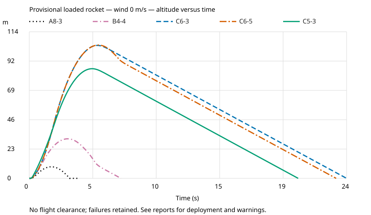
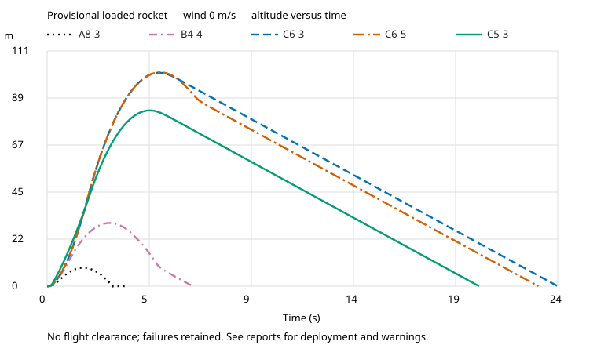
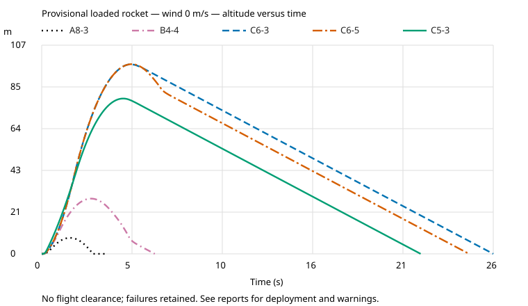

# Flight plots

These SVGs are drawn by our Python reporting code from saved OpenRocket results, not exported by OpenRocket's GUI. They
show the actual loading at zero wind; consult the review reports for the full case matrix.

The [Okabe–Ito palette](https://jfly.uni-koeln.de/color/) is paired with distinct line patterns and dark legend labels.
Motor styles remain consistent across designs. Colors alone do not carry the distinction. Only presentation changed;
simulation data and historical review bundles remain unchanged.

## Compact

## Longer

## Larger recovery

