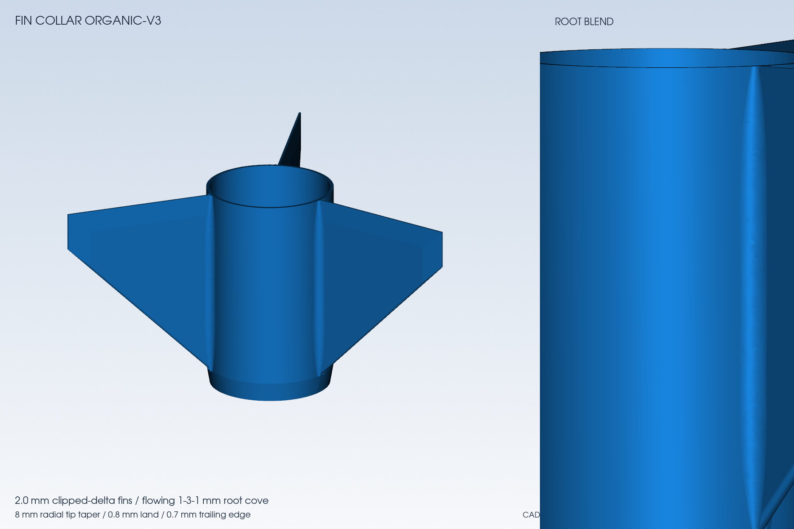
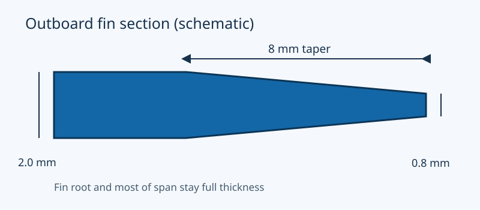

# D12 fin and nose tip refinement

This is the current CAD review for the D12-5 / BT-60, 50 mm conical nose, 500 mm body and three clipped-delta fins. It
uses the same insert-trial bay layout as the preceding organic fin-collar review. These files are printable geometry for
fit and strength checks, not flight-qualified parts.

| Detail                    |                                          Geometry |
| ------------------------- | ------------------------------------------------: |
| Fin root and most of span |                                      2.0 mm thick |
| Outer fin taper           |             Last 8 mm of 53.65 mm span, symmetric |
| Outboard edge             |   About 0.8 mm thick, with existing edge rounding |
| Trailing edge             | Existing 0.7 mm edge after a 7 mm chordwise taper |
| Nose tip                  |               1.0 mm radius tangent spherical cap |
| Nose shoulder             |                              0.3 mm outer lead-in |

The clipped-delta outline, 65 mm root, 53.65 mm span, leading-edge rounding and tangent root coves are unchanged. The
nose retains its 50 mm axial length and 41.6 mm base diameter. Existing configurations without the new tip settings keep
their previous CAD geometry, and the `organic-v2` fin remains available.

## Downloads and checks

- [Resolved configuration](assets/tip-refinement-v3/config.json),
  [design summary](assets/tip-refinement-v3/design-summary.json),
  [flight screen](assets/tip-refinement-v3/flight-screen.json),
  [slice screen](assets/tip-refinement-v3/slice-screen.json) and [hash manifest](assets/tip-refinement-v3/SHA256SUMS)
- [Fin STEP](assets/tip-refinement-v3/cad/fin-collar.step) and
  [print-oriented STL](assets/tip-refinement-v3/cad/fin-collar.stl)
- [Nose STEP](assets/tip-refinement-v3/cad/nose-bay.step) and
  [print-oriented STL](assets/tip-refinement-v3/cad/nose-bay.stl)
- [Assembly STEP for fit review only](assets/tip-refinement-v3/cad/assembly.step), plus the separate, unchanged
  [bulkhead](assets/tip-refinement-v3/cad/bay-bulkhead.stl), [sled](assets/tip-refinement-v3/cad/payload-sled.stl), and
  [lug sleeves](assets/tip-refinement-v3/cad/lug-sleeve-1.stl) ([second](assets/tip-refinement-v3/cad/lug-sleeve-2.stl))
  as STLs
- [Unsliced X1C review project](assets/tip-refinement-v3/tip-refinement-X1C-review.3mf) and
  [sliced X1C preview project](assets/tip-refinement-v3/sliced-tip-refinement-X1C.3mf) for the revised nose and fin
  collar

The assembly STEP places components together to check fit. It is **not a single print**. Print the six STL parts
separately, fit the purchased tube and hardware, and assemble the bulkhead and sled after printing. The two-part X1C
project above is a review of the changed nose/bay shell and fin collar; it is not the complete avionics assembly.

Both changed parts are valid single solids. CAD solid-density estimates are 28.745 g for the fin collar and 31.477 g for
the nose bay. Relative to the prior organic fin collar configuration, the fin collar loses about 0.173 g and the nose
bay gains about 0.921 g; the two-part net gain is about 0.749 g. Print and finish mass must be measured.

All nine configured OpenRocket cases completed and met their configured simulation criteria. For the loaded dummy/actual
cases across 0, 2 and 4 m/s winds, modeled guide departure is 12.86–12.87 m/s, minimum ascent stability 1.69–1.79 cal,
and apogee 174.15–181.04 m. The model still has 13 categories of unmeasured hardware and assembly inputs, so these are
screening results rather than launch clearance.

## Structural interpretation

A simple cantilever calculation treats each fin as a rectangular section under a lateral point load at its outboard tip.
With the same fin outline and material modulus, the short taper increases calculated elastic tip deflection by about
0.9% relative to a constant 2.0 mm fin. The root remains full thickness. This comparison excludes the root cove, print
paths, layer bonds, temperature, impact and fin flutter, so it is **not** a strength or flight-load rating.

Before flight use, inspect the actual sliced paths through the 0.8 mm tip and root cove, then print a collar with the
intended filament, orientation and settings. Check for warping and delamination; apply repeatable sideways loads at a
marked tip location and inspect the roots after unloading. Weigh the finished assembly and rerun flight cases with
measured mass and balance. The
[NAR safety inspection guidance](https://www.nar.org/content.aspx?club_id=114127&module_id=673715&page_id=22) likewise
calls for checking fin movement, deflection, warping and root damage.

Bambu Studio 02.08.02.61 sliced the two revised parts with the X1C 0.4 mm nozzle, 0.20 mm Standard profile, Generic PLA,
Textured PEI, three walls, 100% infill, build-plate-only supports and a 5 mm brim. The slicer returned success with no
warning message. Its G-code assigns support features to the nose, and none to the fin collar. The 76.58 g two-part
filament estimate includes supports and brim; it is not installed flight mass. Inspect the preview around the thin fin
edge, root coves and nose cap before printing. Successful slicing does not establish layer bonding or removable
supports.

OpenRocket uses a nominal conical nose and square fin cross section here, so it does not resolve these small surface
changes aerodynamically. The CAD-derived mass and center of gravity are passed to the flight model. Existing rocket CFD
results do not establish a drag benefit for this revision.

## Fin leading edge and root clearance review

The [v4 fin STL](assets/fin-root-review-v4/fin-collar.stl) and
[Bambu Studio project](assets/fin-root-review-v4/fin-collar-review.3mf) are a separate review candidate. The
[STEP](assets/fin-root-review-v4/fin-collar.step) retains assembly coordinates; the
[sliced project](assets/fin-root-review-v4/fin-collar-sliced.3mf) contains local toolpaths for inspection. This
candidate adds a 4 mm leading edge bevel that leaves a 0.8 mm land, and relieves the fin root near the two collar rim
ends so the cove stops short of each end. The eight millimeter outer tip taper and seven millimeter trailing edge taper
remain. The CAD result is one valid fin collar solid; Bambu Studio 02.08.02.61 completed a local X1C slice. The v4
toolpaths include support features, so inspect and adjust orientation and support placement before printing. The v3
files above remain the current matched flight study until this variant is inspected and selected.

## Print oriented fin review

The [v5 preview](assets/fin-print-review-v5/fin-collar-review.png), [STL](assets/fin-print-review-v5/fin-collar.stl),
and [Bambu Studio project](assets/fin-print-review-v5/fin-collar-review.3mf) show the simpler print review candidate.
The [sliced project](assets/fin-print-review-v5/fin-collar-sliced.3mf) and
[STEP](assets/fin-print-review-v5/fin-collar.step) are available for toolpath and fit inspection. The
[review summary](assets/fin-print-review-v5/review-summary.json) and
[SHA manifest](assets/fin-print-review-v5/manifest.json) record the exact files.

This variant sets the fin attachment edge 2 mm inside each collar rim as part of the outline, with no separately cut
triangular root notch. The 1.7 mm root cove stays constant along its middle and eases down to a small radius within 0.1
mm of each fin end. A 4 mm leading bevel starts outside the 2 mm root zone; the outer tip and trailing edge stay at the
full 2 mm thickness. These choices simplify printing. No measured drag comparison supports the removed tapers.

The v5 STL and project place the collar **aft end down**, following the [orientation comparison](PRINT_ORIENTATION.md).
Bambu Studio 02.08.02.61 sliced this orientation with X1C 0.4 mm, 0.20 mm Standard, Generic PLA, Textured PEI, three
walls, 100% infill, build-plate-only supports, and a 5 mm brim. Its estimate was 27.86 g including print consumables and
68.6 minutes. The same geometry in forward-down orientation failed the local CLI slice. The v5 result is a print review
candidate; the v3 flight cases above have not been recomputed for this geometry or a measured printed mass.
